# GTFS Miner — Architecture Système (Phase 0)

## Vue d'ensemble

```mermaid
graph TB
    %% ─────────────────────────────────────────────
    %% FRONTEND
    %% ─────────────────────────────────────────────
    subgraph FE["🖥️  Frontend  (React + TypeScript + Vite)"]
        direction LR
        FE_Upload["📤 Upload GTFS ZIP"]
        FE_Params["⚙️  Paramètres\n(HPM / HPS / vacances)"]
        FE_Progress["📊 Progression\n(WebSocket)"]
        FE_Results["📋 Résultats\n(tables paginées)"]
        FE_Download["⬇️  Téléchargement ZIP"]
    end

    %% ─────────────────────────────────────────────
    %% API FASTAPI
    %% ─────────────────────────────────────────────
    subgraph API["⚡  FastAPI Backend  (app/main.py — /api/v1)"]
        direction TB
        API_Create["POST /projects/"]
        API_Status["GET /projects/{id}"]
        API_Upload["POST /projects/{id}/upload"]
        API_Table["GET /projects/{id}/tables/{name}"]
        API_DL["GET /projects/{id}/download"]
        API_WS["WS /projects/{id}/ws\n(ConnectionManager)"]
    end

    %% ─────────────────────────────────────────────
    %% WORKER
    %% ─────────────────────────────────────────────
    subgraph WK["🔧  Background Worker  (services/worker.py)"]
        WK_Run["run_project_task_sync()"]
        WK_S1["1/7 · Lecture ZIP"]
        WK_S2["2/7 · Normalisation"]
        WK_S3["3/7 · Clustering spatial"]
        WK_S4["4/7 · Génération itinéraires"]
        WK_S5["5/7 · Lignes & sous-lignes"]
        WK_S6["6/7 · Dates de service"]
        WK_S7["7/7 · Passages & KCC"]
        WK_Run --> WK_S1 --> WK_S2 --> WK_S3 --> WK_S4 --> WK_S5 --> WK_S6 --> WK_S7
    end

    %% ─────────────────────────────────────────────
    %% PIPELINE GTFS CORE
    %% ─────────────────────────────────────────────
    subgraph PL["🔬  GTFS Core Pipeline  (services/gtfs_core/)"]
        direction TB

        subgraph NORM["gtfs_norm.py"]
            N1["rawgtfs_from_zip()\n— détection encodage"]
            N2["gtfs_normalize()\n— stops / routes / trips\n  stop_times / calendar"]
            N3["ligne_generate()"]
            N1 --> N2 --> N3
        end

        subgraph SPAT["gtfs_spatial.py"]
            SP1{"≥ 5 000 stops ?"}
            SP2["ag_ap_generate_bigvolume()\nK-Means + Hiérarchique"]
            SP3["ag_ap_generate_hcluster()\nDBSCAN / 100 m"]
            SP4["ag_ap_generate_asit()\nparent_station natif"]
            SP1 -->|oui| SP2
            SP1 -->|non| SP3
            SP1 -->|parent_station complet| SP4
        end

        subgraph GEN["gtfs_generator.py"]
            G1["itineraire_generate()"]
            G2["course_generate()\nitiarc_generate()"]
            G3["sl_generate()"]
            G4["service_date_generate()\nservice_jour_type_generate()"]
            G5["nb_passage_ag()\npassage_arc()"]
            G6["nb_course_ligne()\ncaract_par_sl()\nkcc_course_ligne()\nkcc_course_sl()"]
            G1 --> G2 --> G3 --> G4 --> G5 --> G6
        end

        subgraph EXP["gtfs_export.py"]
            E1["MEF_course() · MEF_iti()\nMEF_iti_arc() · MEF_ligne()\nMEF_serdate() · MEF_servjour()\n→ 16 fichiers CSV"]
        end

        subgraph UTILS["Utilitaires transverses"]
            U1["gtfs_utils.py\n— Haversine, temps, encodage"]
            U2["gtfs_schemas.py\n— Pandera (AP/AG/Course…)"]
        end

        NORM --> SPAT --> GEN --> EXP
        NORM -.->|valide| U2
        SPAT -.->|valide| U2
        GEN -.->|valide| U2
        NORM -.->|utilise| U1
        SPAT -.->|utilise| U1
        GEN -.->|utilise| U1
    end

    %% ─────────────────────────────────────────────
    %% STOCKAGE
    %% ─────────────────────────────────────────────
    subgraph ST["💾  Stockage  (Phase 0 — local)"]
        ST_DB[("SQLite\nstorage/miner_app.db\nProject : id · status · parameters")]
        ST_TMP["storage/temp/\n(ZIPs uploadés)"]
        ST_OUT["storage/projects/{id}/output/\n(16 CSV + ZIP résultats)"]
    end

    %% ─────────────────────────────────────────────
    %% FLUX DE DONNÉES
    %% ─────────────────────────────────────────────

    %% Upload
    FE_Upload -->|"POST /upload\nGTFS ZIP"| API_Upload
    FE_Params -->|paramètres JSON| API_Create

    %% API → Stockage + Worker
    API_Upload -->|"sauvegarde ZIP"| ST_TMP
    API_Upload -->|"crée / met à jour\nstatut → processing"| ST_DB
    API_Upload -->|"BackgroundTasks"| WK_Run

    %% Worker → Pipeline
    WK_S1 -->|"rawgtfs_from_zip()"| NORM
    WK_S2 -->|"gtfs_normalize()"| NORM
    WK_S3 -->|"ag_ap_generate_reshape()"| SPAT
    WK_S4 -->|"itineraire_generate()"| GEN
    WK_S7 -->|"MEF_*()"| EXP

    %% Pipeline → Stockage
    EXP -->|"16 fichiers CSV"| ST_OUT
    WK_Run -->|"status completed / failed"| ST_DB

    %% Worker → WebSocket
    WK_Run -->|"broadcast étape + temps"| API_WS
    API_WS -->|"messages temps réel"| FE_Progress

    %% Lecture résultats
    FE_Results -->|"GET /tables/{name}"| API_Table
    API_Table -->|"lit métadonnées"| ST_DB
    API_Table -->|"renvoie données paginées"| FE_Results

    FE_Download -->|"GET /download"| API_DL
    API_DL -->|"lit"| ST_OUT
    API_DL -->|"ZIP stream"| FE_Download

    FE_Upload -->|"GET /projects/{id}"| API_Status
    API_Status -->|"lit statut"| ST_DB

    %% ─────────────────────────────────────────────
    %% STYLES
    %% ─────────────────────────────────────────────
    classDef fe     fill:#dbeafe,stroke:#3b82f6,color:#1e3a5f
    classDef api    fill:#dcfce7,stroke:#22c55e,color:#14532d
    classDef worker fill:#fef9c3,stroke:#eab308,color:#713f12
    classDef pipe   fill:#f3e8ff,stroke:#a855f7,color:#3b0764
    classDef store  fill:#ffe4e6,stroke:#f43f5e,color:#4c0519

    class FE_Upload,FE_Params,FE_Progress,FE_Results,FE_Download fe
    class API_Create,API_Status,API_Upload,API_Table,API_DL,API_WS api
    class WK_Run,WK_S1,WK_S2,WK_S3,WK_S4,WK_S5,WK_S6,WK_S7 worker
    class N1,N2,N3,SP1,SP2,SP3,SP4,G1,G2,G3,G4,G5,G6,E1,U1,U2 pipe
    class ST_DB,ST_TMP,ST_OUT store
```

---

## Couches et responsabilités

| Couche | Technologie | Rôle |
|--------|-------------|------|
| **Frontend** | React 18 + TypeScript + Vite | Upload, configuration, suivi temps réel, consultation |
| **API** | FastAPI + Pydantic | Routes REST + WebSocket, validation requêtes |
| **Worker** | `BackgroundTasks` FastAPI | Orchestration pipeline, broadcast progression |
| **GTFS Core** | Pandas + SciPy + scikit-learn + Pandera | Tout le traitement algorithmique |
| **Stockage** | SQLite (Phase 0) → Supabase PostgreSQL (Phase 1) | Persistance état projets + fichiers |

## Sorties du pipeline (16 fichiers CSV)

| Groupe | Fichiers |
|--------|----------|
| Arrêts | `A_1_Arrets_Generiques.csv` · `A_2_Arrets_Physiques.csv` |
| Lignes | `B_1_Lignes.csv` · `B_2_Sous_Lignes.csv` |
| Courses | `C_1_Courses.csv` · `C_2_Itineraire.csv` · `C_3_Itineraire_Arc.csv` |
| Service | `D_1_Service_Dates.csv` · `D_2_Service_Jourtype.csv` |
| Passages | `E_1_Nombre_Passage_AG.csv` · `E_4_Nombre_Passage_Arc.csv` |
| Métriques | `F_1_Nombre_Courses_Lignes.csv` · `F_2_Caract_SousLignes.csv` · `F_3_KCC_Lignes.csv` · `F_4_KCC_Sous_Ligne.csv` |

## Évolutions prévues (Phase 1)

| Composant actuel | Remplacement Phase 1 |
|-----------------|----------------------|
| SQLite | Supabase (PostgreSQL) |
| `BackgroundTasks` | Celery + Redis |
| Stockage local | Supabase Storage |
| Pas d'auth | Supabase Auth |
| Frontend minimal | Composants complets + MapLibre GL JS |
