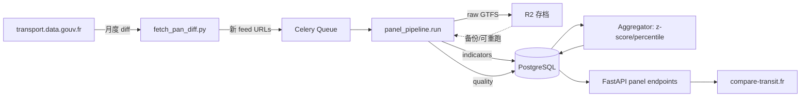

# compare-transit.fr — MVP 设计规范

**版本**：0.1（Brainstorming 输出）
**日期**：2026-05-03
**作者**：Wei SI（与 Claude 协作）
**状态**：📝 Draft，待用户审阅
**实施前置**：本 spec 完成后通过 `superpowers:writing-plans` 技能产出实施计划

---

## 1. 产品定位

**一句话定位**：法国公共交通供给侧的彭博终端 + S&P 数据质量评级。

**详细定位**：
将 PAN（transport.data.gouv.fr）上 463 个法国 AOM 的 GTFS feed 历史数据，标准化处理后呈现为可比较、可时序、可分享的网络指标面板与数据质量评分。

公开数据，免费访问；商业化通过 Pro 工作流层（PDF/PPT 导出、API、私有 GTFS 上传分析）。

**两个产品轴**：

1. **供给侧分析轴** — 网络生产力、密度、覆盖、频率、可达性、模态混合等业务指标
2. **数据质量评级轴** — 每个 GTFS feed 的合规度、完整度、可用性评分

两轴叉乘产生四象限故事（"高质量数据 + 强供给"、"差数据 + 看似强供给（数据失真）"等），是产品的核心叙事价值。

**与 GART 的关系**：**不替代 GART 的法定地位** — GART 年报仍是 AOM 上报议会、申请 France Mobilités 经费的官方口径。compare-transit.fr 提供的是**更现代、更频繁、更透明的供给侧分析镜像**：

- 让 AOM 与顾问能在 GART 周期外（而不是等一年）即时分析
- 让 GART 报告中的供给侧数字可被独立事实核查
- GART 覆盖的需求/财务/质量/人力指标我们**不重新发明**，留给 V2+ 通过 GART 历史数据 join 实现

---

## 2. 战略决策（Brainstorming 已对齐）

| 维度 | 决策 | 备注 |
|------|------|------|
| 主受众 | B（顾问 productivity）+ A（媒体 virality） | B 主 A 副 |
| 品牌定位 | **新主品牌**；当前 GTFS Miner 退化为 Pro 私有上传层 | 域名 `compare-transit.fr` |
| 网络覆盖 | 全部 463 个 PAN GTFS 数据集（2026-04 实测） | 不剔除小型网络 |
| 历史深度 | 每个网络拉到 PAN 上的最大可追溯深度 | 不设统一上限；早期发布者可达 2018 |
| 工程边界 | **MVP 仅宏观/派生指标**；不做站点/线路 ID 对齐 | 对齐溢价归 Pro 层 |
| 治理模式 | 开源方法论 + 并行接洽 Cerema/GART | GitHub repo 是基线；联合署名为可选 upside |
| 商业模式 | 数据全免费；Pro = 工作流加速器 | 类 Bloomberg 模式 |

---

## 3. MVP 范围

### 3.1 包含

- ✅ 全部 PAN 上发布 GTFS 的法国 AOM（463 个数据集，2026-04 PAN 实测）
- ✅ 每个网络拉到最大可追溯历史深度（按 PAN 实际发布版本数）
- ✅ 38 个核心指标（35–40 个范围内）+ 派生层（z-score、percentile、YoY 变化）
- ✅ 数据质量评级体系（基于 MobilityData GTFS Validator + 法国特定规则）
- ✅ 网络详情页（每网络一个独立 SEO 友好 URL）
- ✅ 网络对比页（最多 5 个网络并列）
- ✅ 指标排行榜页（按指标查看全部网络排名）
- ✅ 数据质量排行榜
- ✅ Peer group benchmark（基于人口/模态混合的预定义分层）
- ✅ 方法论开源仓库（GitHub）+ 每指标公式文档
- ✅ 月度自动更新（节奏待 Discovery Task 1 验证）

### 3.2 不包含

- ❌ 站点级、线路级、子线路级精细分析（归属 Pro 上传层）
- ❌ 网络重构 before/after 模拟（同上）
- ❌ GTFS-RT 实时数据
- ❌ 多国扩展（仅法国）
- ❌ 用户上传功能（在新品牌站不暴露；仅在 GTFS Miner Pro 域名下保留）
- ❌ 用户账号系统、付费墙（V1 引入，MVP 不需要）
- ❌ LLM Agent 自然语言查询（V2）
- ❌ 自动化 PDF/PPT 报告导出（V1 工作流加速器）
- ❌ AOM 后台（"修正我们网络数据"申诉）— V1 引入
- ❌ 公开 API 产品（带 API key 鉴权、限速、API 文档站点、SDK — V1 引入）。注：前端访问的后端 endpoints 见 §8，是公开无鉴权的，但**不**作为产品对外宣传，也不承诺 SLA

**GART 完整指标谱中我们故意不覆盖的部分**（详见 §5.1 末尾 GART 覆盖矩阵）：

- ❌ **需求侧指标**（年客流、人均出行、占用率）：需 AOM/运营商内部数据；V2 通过 GART 历史数据 join 实现
- ❌ **财务指标**（recettes、R/D、coût/voyage、Versement Mobilité 收入）：需 AOM 公开财报；V2 引入
- ❌ **服务质量指标**（régularité、disponibilité、satisfaction）：需 GTFS-RT；V2 实现
- ❌ **人力指标**（effectifs、conducteurs、ETP）：不计划
- ❌ **容量绝对值**（places-km offertes）：需运营商车队数据；MVP 不发布。**用 `prod_peak_vehicles_needed` 替代**作为运力代理（纯 GTFS 派生，无假设）
- ❌ **通勤 OD 覆盖**（`econ_commute_pair_cov`）：V1 通过 INSEE MOBPRO 集成实现

---

## 4. 受众与价值场景

### 4.1 主要受众（B — 顾问 productivity）

**Persona**：SETEC、Transamo、EGIS Rail 的中级分析师，正在准备投标 PPT 或客户评估报告。

**核心场景**：
1. 进站搜索"Bordeaux" → 详情页看 KCC、覆盖率、模态混合 + peer 对比 + 5 年趋势
2. 选 5 个 peer 网络对比 → 截图/复制数据到 PPT 第三页
3. 切到指标排行榜 → 查"哪些网络与 Bordeaux 在 KCC/人均上同档"

**MVP 成功指标**（B）：5 分钟内完成本来要 2 天的 peer comparison slide。

### 4.2 副要受众（A — 媒体 virality）

**Persona**：Le Monde Décodeurs、Mediacités、Libération 数据组的记者。

**核心场景**：
1. 阅读 GTFS 数据质量年度报告（产品方主动发布的 PR 文章）
2. 来站验证某条 finding（"30% 的 AOM GTFS 不合规"）
3. 找到 outlier 网络做深度报道
4. 在文章里链接到具体网络详情页（`compare-transit.fr/network/<slug>`）

**MVP 成功指标**（A）：上线后 3 个月内被至少一篇主流媒体引用。

### 4.3 副向受众

| 受众 | 用途 |
|------|------|
| **AOM 内部分析师** | 政治辩护材料；议会汇报；预算论证 |
| **Cerema / GART** | 现代化他们的方法论；潜在合作伙伴 |
| **运营商投标团队**（Keolis/Transdev） | 竞标 DSP 的数据弹药 |
| **学术研究者**（Université Gustave Eiffel、IRT SystemX） | 论文数据源 |
| **下游消费者**（Citymapper、Mappy、Google Maps、navitia.io） | 选择优先集成的 feed |

---

## 5. 指标体系

### 5.1 38 个核心指标

#### A. 生产力（8）

| ID | 名称 | 单位 | 公式 |
|----|------|------|------|
| `prod_kcc_year` | 年度 KCC（商业里程） | km | Σ trips × Σ segments × haversine × days_active |
| `prod_courses_day_avg` | 日均班次数 | trips/day | Σ trips × days_active / total_days |
| `prod_peak_hour_courses` | 峰时班次数 | trips/h | trips departing during HPM/HPS window |
| `prod_service_amplitude` | 服务时段宽度 | h | max(stop_time) − min(stop_time) |
| `prod_lines_count` | 线路数 | count | count(distinct route_id) — GART 对齐 |
| `prod_stops_count` | 站点数 | count | count(distinct stop_id where location_type=0) — GART 对齐 |
| `prod_network_length_km` | 网络商业线路长度 | km | sum of unique geographic segments（去重相邻 routes 共享段）— GART 对齐 |
| `prod_peak_vehicles_needed` | 高峰所需车辆数 | count | Σ_route ⌈peak_round_trip_time / peak_headway⌉ — 替代 places-km，纯 GTFS 派生 |

#### B. 密度（4）

| ID | 名称 | 单位 | 公式 |
|----|------|------|------|
| `dens_stops_km2` | 站点密度 | stops/km² | count(stops) / AOM 面积 |
| `dens_lines_100k_pop` | 线路人均密度 | lines/100K | count(lines) / population × 100K |
| `dens_kcc_capita` | 人均 KCC | km/capita | prod_kcc_year / population |
| `dens_kcc_km2` | 单位面积 KCC | km/km² | prod_kcc_year / AOM 面积 |

#### C. 网络结构（7）

| ID | 名称 | 单位 | 公式 |
|----|------|------|------|
| `struct_modal_mix_bus` | 公交占比 | % | trips with route_type=3 / total |
| `struct_modal_mix_tram` | 有轨电车占比 | % | route_type=0 |
| `struct_modal_mix_metro` | 地铁占比 | % | route_type=1 |
| `struct_modal_mix_train` | 火车占比 | % | route_type=2 |
| `struct_peak_amplification` | 峰平放大率 | 倍 | peak hour trips / off-peak hour trips |
| `struct_multi_route_stops_pct` | 多线换乘点比例 | % | stops served by ≥2 routes / total stops |
| `struct_route_directness` | 线路曲折度（中位）| ratio | median over routes of (actual_route_length / great_circle_OD_distance) |

#### D. 覆盖（6）

| ID | 名称 | 单位 | 公式 |
|----|------|------|------|
| `cov_pop_300m` | 300m 圈人口覆盖率 | % | INSEE 200m 网格 ∩ stops 300m buffer / total pop |
| `cov_pop_freq_300m` | 高频服务覆盖率 | % | 同上但 stops 必须有 ≤10min 峰时间隔 |
| `cov_surface_300m` | 面积覆盖率 | % | (300m buffer ∩ AOM polygon) area / AOM area |
| `cov_median_walk` | 站点中位步行距离 | m | INSEE 网格中心到最近站点的中位数 |
| `cov_pop_weighted_walk` | 人口加权步行距离 | m | Σ(IRIS pop × min_walk) / Σ pop — 比 binary 300m 强一档 |
| `cov_equity_gini` | IRIS 覆盖率基尼系数 | 0–1 | Gini 系数 over per-IRIS coverage rate — 公平性政治弹药 |

#### E. 频率与速度（4）

| ID | 名称 | 单位 | 公式 |
|----|------|------|------|
| `freq_peak_headway_median` | 峰时中位间隔 | min | median over lines of (peak_hour_trips → headway) |
| `freq_high_freq_lines_pct` | 高频线路比例 | % | lines with peak headway ≤10 min / total lines |
| `freq_daily_service_hours` | 日均服务时长 | h | mean(amplitude) over weekdays |
| `freq_commercial_speed_kmh` | 商业速度 | km/h | Σ trip_distance / Σ trip_duration — GART 对齐 |

#### F. 可达性（2）

| ID | 名称 | 单位 | 公式 |
|----|------|------|------|
| `acc_wheelchair_stops_pct` | 轮椅可达站点比例 | % | stops where wheelchair_boarding=1 / total |
| `acc_wheelchair_trips_pct` | 轮椅可达班次比例 | % | trips where wheelchair_accessible=1 / total |

#### G. 数据质量（6）

| ID | 名称 | 单位 | 公式 |
|----|------|------|------|
| `dq_validator_errors` | Validator 错误数 | count | MobilityData validator 严重级别 ERROR |
| `dq_validator_warnings` | Validator 警告数 | count | severity WARNING |
| `dq_field_completeness` | 字段完整度 | 0–100 | 必填字段非空率加权平均 |
| `dq_coord_quality` | 坐标合理性 | % | stops within AOM polygon ∩ within France bbox |
| `dq_route_type_completeness` | route_type 完整度 | % | 1 − (rows defaulted to 3) |
| `dq_freshness` | 数据新鲜度 | days | now − last_published_date |

**质量综合分**（派生）：每个指标 0–100，按如下权重加权：

```
overall_quality_score =
    0.25 × dq_validator_errors_normalized
  + 0.20 × dq_field_completeness
  + 0.15 × dq_coord_quality
  + 0.15 × dq_route_type_completeness
  + 0.15 × dq_freshness_score
  + 0.10 × dq_validator_warnings_normalized
```

转换为字母等级：A+ (≥95) / A (90–94) / A− (85–89) / B+ (80–84) / B (75–79) / ... / F (<50)。

#### H. 环境（1）

| ID | 名称 | 单位 | 公式 |
|----|------|------|------|
| `env_co2_year_estimated` | 估算年 CO2 排放 | tCO2/year | Σ (KCC_by_route_type × ADEME 排放因子_by_route_type) |

**披露要求**（写入方法论 GitHub README）：
- 排放因子来源：**ADEME Base Carbone v23+**（2026 版）
- 假设：按 route_type 分模式平均，**不**反映具体车型（电动 vs 柴油 bus 差异 ~5×）
- 标识：UI 上必须显示"Estimation order-of-magnitude，不可用于法律 GHG 报告"
- 误差量级：±30% 对柴油主导网络；±50% 对混合电动网络
- 公式与排放因子表完整发布在 `compare-transit/methodology` 仓库 `co2_methodology.md`

### 5.1bis GART 指标覆盖矩阵

| GART 指标类别 | GART 子指标 | 我们的对应 | MVP 状态 |
|--------------|------------|----------|---------|
| **供给（Offre）** | Véhicules-km commerciaux/an | `prod_kcc_year` | ✅ |
| | Nombre de lignes | `prod_lines_count` | ✅ |
| | Nombre de points d'arrêt | `prod_stops_count` | ✅ |
| | Longueur réseau commercial | `prod_network_length_km` | ✅ |
| | Vitesse commerciale moyenne | `freq_commercial_speed_kmh` | ✅ |
| | Places-km offertes/an | — | ❌ 需运营商车队数据；用 `prod_peak_vehicles_needed` 代理 |
| | Effectif de la flotte | — | ❌ 不在 GTFS；不计划 |
| **需求（Usage）** | Voyages/an | — | ❌ 需运营商客流；V2 通过 GART join |
| | Voyages/habitant | — | ❌ 同上 |
| | Taux d'occupation | — | ❌ 同上 |
| **财务** | Recettes / Dépenses (R/D) | — | ❌ 需 AOM 财报；V2 |
| | Coût/voyage、Coût/km | — | ❌ 同上 |
| | Versement Mobilité | — | ❌ 同上 |
| **服务质量** | Régularité、Disponibilité | — | ❌ 需 GTFS-RT；V2 |
| | Satisfaction | — | ❌ 需问卷；不计划 |
| **人力** | Effectifs、ETP | — | ❌ 不计划 |
| **环境** | Part véhicules propres | `struct_modal_mix_*` (代理) | ⚠️ 部分（电气化模式 KCC 占比） |
| | Émissions CO2 | `env_co2_year_estimated` | ✅ 估算（披露假设） |
| **拓展（GART 不报但我们提供）** | 网络拓扑结构 | `struct_multi_route_stops_pct`、`struct_route_directness` | ✅ |
| | 服务公平性 | `cov_equity_gini`、`cov_pop_weighted_walk` | ✅ |
| | 时序可比 | 全部指标 + 派生层 YoY | ✅ |
| | 数据质量评级 | `dq_*` 6 项 + 综合等级 | ✅ |

### 5.2 派生指标层

每个核心指标产生三个派生值：

1. **`<id>_zscore`** — 在 peer group 内的 z-score
2. **`<id>_percentile`** — 在 peer group 内的百分位排名
3. **`<id>_yoy_delta`** — 与 12 个月前同指标的变化率（仅当历史可达 ≥12 个月时计算）

### 5.3 Peer Group 定义（MVP 简化版）

MVP 用**预定义 tier-based 分组**，V2 引入 PCA 自动聚类。

| Tier | 定义 | 例子 |
|------|------|------|
| **T1 — 大都市圈含地铁** | pop ≥1M + 含 metro | Paris (IDFM)、Lyon、Marseille、Lille、Toulouse |
| **T2 — 大都市圈无地铁** | pop 500K–1M | Bordeaux、Nantes、Nice、Strasbourg、Montpellier、Rennes |
| **T3 — 中型城市** | pop 200K–500K | Grenoble、Tours、Reims、Le Havre、Brest |
| **T4 — 中小城市** | pop 100K–200K | ~30 个 AOM |
| **T5 — 小型 AOM** | pop <100K | ~250 个 AOM |
| **R — 区域网络** | route_type 主导 = 2 (train/TER) | TER Grand Est、TER PACA... |
| **I — 城际/省际** | 主导模式跨 commune | 各省 départemental |

每个网络归属一个 tier，z-score/percentile 在同 tier 内计算。

人口数据来自 INSEE，AOM 边界来自 `data.gouv.fr` 上的 `aom_2024` 数据集。

---

## 6. 数据架构

### 6.1 数据源

| 来源 | 用途 | 访问方式 | 缓存策略 |
|------|------|---------|---------|
| **transport.data.gouv.fr (PAN)** | GTFS feed + 历史版本目录 | `/api/datasets`、`/api/datasets/{datagouv_id}`、`/datasets/{short_id}/resources_history_csv` | 月度 diff；feed 内容缓存到 R2；**强制 dedup by `feed_start_date`**（见下） |

**关键 PAN 接入策略**（2026-04 实测验证）：

PAN 的 `resources_history_csv` 包含**大量元数据重复**：同一 GTFS feed 因 metadata 微调被反复登记为新 resource version。SNCF 单网络 raw history 7,434 行，但去重后真正不同的 feed 数量低一个量级。

**Dedup 流程（必须）**：
1. 拉 `resources_history_csv` 得到该网络全部 raw 历史行
2. 每行 `payload.zip_metadata` 含每个 ZIP 内文件的 sha256
3. 取 `feed_info.txt` 的 sha256 作为 dedup key（fallback：`calendar.txt` → `calendar_dates.txt`）
4. 对每个独特 sha，用 `remotezip` HTTP Range 仅下载 `feed_info.txt`（几 KB），解析 `feed_start_date`
5. 同一 `feed_start_date` 保留 `inserted_at` 最新的 resource
6. 这才是真正需要进入处理管线的 distinct feeds 集合

**带宽节省**：dedup probe 只读 feed_info.txt 或 calendar.txt（~1–10 KB × 实际 unique sha 数量），而不是全量下载历史 ZIP（>50 GB）后再 dedup。这是工程上的**关键优化**。

**实测数据规模**（PAN 2026-04 全网扫描）：

| 指标 | 值 |
|------|---|
| GTFS 数据集总数 | 463 |
| 有非空历史的数据集 | 455 |
| Raw history rows 总数 | 122,558 |
| 单网络 raw rows 中位 | 47 |
| 单网络 raw rows p90 | 680 |
| 单网络 raw rows max | 7,434（SNCF） |
| 压缩 feed 大小中位 | 0.27 MB |
| 压缩 feed 大小 p90 | 2.94 MB |
| 压缩 feed 大小 max | 10.7 MB |
| 压缩 feed 大小 mean | 0.93 MB |
| 非 GTFS 比例（实测样本） | Strasbourg 0% / Transilien 50%（混合 NeTEx） |
| GTFS-only dedup ratio（D1 实测样本） | Strasbourg 1.05× · Transilien 2.65× · **均值 1.85×** |
| Dedup 后 distinct feeds 估算 | **~30,000–35,000**（保守，待 Plan 2 全量回填校准） |
| 全量归档大小估算 | **~25–35 GB** 压缩（mean 0.93 MB/feed） |
| 处理时间估算 | ~250 CPU 小时单线程；4 核并行 ~60 小时（2.5 天连续） |
| 实测来源 | `docs/superpowers/specs/2026-05-03-pan-history-discovery.md`（D1 报告） |
| **INSEE** | 人口数据（commune + IRIS + 200m 网格） | data.gouv.fr 数据集下载 | 年度更新；内置随版本 |
| **IGN ADMIN-EXPRESS** | AOM/PTU/commune 行政边界 | data.gouv.fr 下载 | 年度更新；内置随版本 |
| **Cerema MOBI** | AOM 元数据（人口、面积、tier） | 公开 CSV | 年度更新 |
| **MobilityData GTFS Validator** | 数据质量验证 | Java CLI 调用 | 每 feed 一次 |

### 6.2 Pipeline — 局部复用方案

```
panel_pipeline/run.py（新代码 ~250 行）
  │
  ├─ [复用] gtfs_core.gtfs_utils.rawgtfs_from_zip()
  ├─ [复用] gtfs_core.gtfs_norm.gtfs_normalize()
  ├─ [复用] gtfs_core.gtfs_norm.ligne_generate()
  ├─ [跳过] gtfs_core.gtfs_spatial.*（聚类）
  ├─ [跳过] gtfs_core.gtfs_generator.itineraire_*（itineraire）
  ├─ [跳过] gtfs_core.gtfs_generator.sl_generate（sous-ligne）
  ├─ [复用] gtfs_core.gtfs_generator.service_date_generate()
  ├─ [复用] gtfs_core.gtfs_generator.service_jour_type_generate()
  │
  └─ [NEW] panel_pipeline.indicators.compute()
         ├─ panel_pipeline.indicators.productivity.*
         ├─ panel_pipeline.indicators.density.*
         ├─ panel_pipeline.indicators.structure.*
         ├─ panel_pipeline.indicators.coverage.*
         ├─ panel_pipeline.indicators.frequency.*
         ├─ panel_pipeline.indicators.accessibility.*
         └─ panel_pipeline.indicators.quality.*

  └─ [NEW] panel_pipeline.geo.*
         ├─ INSEE/IGN 数据加载
         ├─ AOM 边界 join
         └─ IRIS 200m 覆盖率计算
```

**单 feed 处理时间预算**：
- 中型网络（~5K 站点）：~30s
- IDFM 规模（~50K 站点）：~1–2 min
- 全量回填（dedup 后）463 网络 × 平均 ~65 distinct feeds（D1 实测 dedup ratio 1.85× × 非 GTFS 过滤 ~50%）= **~30,000 feed 处理任务** × 30s 平均 = **~250 CPU 小时**单线程；4 核并行 ~63 小时（约 2.5 天连续）

### 6.3 存储模型（PostgreSQL）

```sql
-- 网络注册表
panel_networks (
  network_id           uuid PK,
  slug                 varchar UNIQUE,           -- URL slug "lyon"
  pan_dataset_id       varchar UNIQUE,           -- PAN 的数据集 ID
  display_name         varchar,                  -- "Métropole de Lyon - TCL"
  aom_id               varchar,                  -- INSEE AOM 标识
  tier                 varchar,                  -- T1/T2/T3/T4/T5/R/I
  population           integer,
  area_km2             numeric,
  first_feed_date      date,                     -- 历史最早可追溯
  last_feed_date       date,                     -- 最近一次发布
  history_depth_months integer,                  -- 派生：用作 badge
  created_at           timestamptz,
  updated_at           timestamptz
)

-- Feed 版本注册表（去重后的 distinct feeds — 见 §6.1 dedup 策略）
panel_feeds (
  feed_id              uuid PK,
  network_id           uuid FK,
  pan_resource_id      varchar,                  -- PAN 的 resource UUID（dedup 后保留 inserted_at 最新的那个）
  pan_resource_history_id varchar,               -- resource_history_id from PAN CSV
  published_at         timestamptz,              -- inserted_at on PAN
  feed_start_date      date,                     -- feed_info.feed_start_date — dedup key
  feed_end_date        date,
  feed_info_sha256     varchar,                  -- sig_sha：feed_info.txt 内容哈希（dedup 工作 key）
  feed_info_source     varchar,                  -- 'feed_info' | 'calendar' | 'calendar_dates'（dedup fallback 链）
  gtfs_url             varchar,                  -- permanent_url（PAN 上的稳定下载链接）
  r2_path              varchar,                  -- 我们 R2 缓存路径
  checksum_sha256      varchar,                  -- ZIP 整体 sha256（与 dedup key 不同）
  filesize             integer,                  -- 压缩字节数
  process_status       varchar,                  -- pending / processing / done / failed
  process_duration_s   numeric,
  error_message        text,
  created_at           timestamptz,
  UNIQUE (network_id, feed_start_date)           -- 去重保证：每网络同一 feed_start_date 仅一行
)

-- 指标值（长格式，便于扩展）
panel_indicators (
  feed_id              uuid FK,
  indicator_id         varchar,                  -- "prod_kcc_year"
  value                double precision,
  unit                 varchar,
  computed_at          timestamptz,
  PRIMARY KEY (feed_id, indicator_id)
)

-- 派生指标缓存（z-score、percentile）
panel_indicators_derived (
  feed_id              uuid FK,
  indicator_id         varchar,
  zscore               double precision,
  percentile           numeric,                  -- 0–100
  yoy_delta_pct        double precision,
  peer_group_size      integer,
  computed_at          timestamptz,
  PRIMARY KEY (feed_id, indicator_id)
)

-- 数据质量详情
panel_quality (
  feed_id              uuid FK PRIMARY KEY,
  validator_errors     jsonb,                    -- MobilityData 完整 JSON 输出
  overall_grade        varchar,                  -- A+/A/A-/.../F
  overall_score        numeric,                  -- 0–100
  computed_at          timestamptz
)

-- Peer group 定义
panel_peer_groups (
  group_id             varchar PRIMARY KEY,      -- "T1", "T2", ...
  display_name         varchar,
  definition           jsonb,                    -- 解释规则
  member_count         integer
)
```

### 6.4 数据流



---

## 7. 前端架构

### 7.1 技术栈

| 层 | 选择 | 理由 |
|----|------|------|
| 框架 | **Vite + React 18 + TypeScript** | 与现有 Pro 工具栈一致；最大化组件复用 |
| SSG | **vike**（前身 vite-plugin-ssr） | 支持 prerender + 客户端 hydration；340 个网络静态生成 |
| 样式 | **Tailwind CSS v4 + shadcn/ui** | 与现有设计系统一致 |
| 数据获取 | **TanStack Query** | 成熟、支持 SSR 数据 hydration |
| 图表 | **Recharts** | 轻量；与 shadcn/ui 视觉协调 |
| 地图 | **MapLibre GL JS** | 与现有 Pro 工具一致 |
| OG 图片 | **satori + Cloudflare Worker** | 为每个网络动态生成分享图 |
| 部署 | **Cloudflare Pages**（静态产物） | 与现有部署一致 |

### 7.2 路由与页面

| 路由 | 页面 | 渲染策略 |
|------|------|---------|
| `/` | 首页（hero + featured + browse） | SSG |
| `/network/[slug]` | 网络详情页（28 指标 + history + peer + quality） | SSG（构建时 prerender 340 个） |
| `/compare?networks=lyon,bordeaux,toulouse` | 网络对比页（最多 5 个） | CSR（动态 query） |
| `/indicators/[indicator_id]` | 指标排行榜（按 indicator 看全部网络排名） | SSG |
| `/quality` | 数据质量国家级仪表板 | SSG |
| `/quality/[slug]` | 单网络数据质量详情 | SSG |
| `/methodology` | 方法论文档（指标公式 + 数据源 + GitHub 链接） | SSG |
| `/about` | 关于产品（团队、价值、Pro 链接） | SSG |
| `/og/[slug].png` | 社交分享 OG 图（动态） | Cloudflare Worker |

### 7.3 信息架构（关键页面）

#### 网络详情页 `/network/lyon`

```
┌─────────────────────────────────────────────────────────────┐
│ [Header: Logo · Nav · Search · Language switch · Pro link]  │
├─────────────────────────────────────────────────────────────┤
│                                                              │
│ [Network Header]                                             │
│   Métropole de Lyon — TCL                                    │
│   T1 大都市圈含地铁  ·  人口 1,420K  ·  面积 538 km²        │
│   📅 Données depuis 2018 (28 trimestres)                     │
│   [Quality Badge: A−] · [Last update: 2026-04-01]            │
│                                                              │
├─────────────────────────────────────────────────────────────┤
│ [Indicator Grid — 7 categories × cards]                      │
│                                                              │
│ ┌────────────────┐ ┌────────────────┐ ┌────────────────┐   │
│ │ KCC/capita     │ │ Pop. coverage  │ │ Modal mix      │   │
│ │ 24.3 km/cap    │ │ 87%            │ │ 🟦Tram 22%     │   │
│ │ ↑ 4.2% YoY     │ │ #2 / 5 (T1)    │ │ 🟥Metro 18%    │   │
│ │ z=+1.4         │ │ z=+0.8         │ │ 🟩Bus 60%      │   │
│ └────────────────┘ └────────────────┘ └────────────────┘   │
│ ... (more cards by category)                                 │
│                                                              │
├─────────────────────────────────────────────────────────────┤
│ [Peer Comparison Table]                                      │
│   T1 大都市圈含地铁 排行                                      │
│   1. Paris (IDFM)    KCC/cap=33.2  Pop.cov=92%  ...         │
│   2. Lyon (TCL)      KCC/cap=24.3  Pop.cov=87%  ...   ←你   │
│   3. Marseille (RTM) ...                                     │
│                                                              │
├─────────────────────────────────────────────────────────────┤
│ [History Charts — multi-indicator time series]               │
│   [ KCC time series 2018–2026, with peer median overlay  ]  │
│   [ Coverage time series 2018–2026                       ]  │
│                                                              │
├─────────────────────────────────────────────────────────────┤
│ [Data Quality Report]                                        │
│   Score: A− (87/100)                                         │
│   ├─ Validator: 3 errors, 12 warnings  [View details]        │
│   ├─ Field completeness: 96%                                 │
│   ├─ Coordinate quality: 98%                                 │
│   └─ Last updated: 32 days ago                               │
│                                                              │
├─────────────────────────────────────────────────────────────┤
│ [Methodology drawer trigger / Share buttons / Pro upgrade]  │
└─────────────────────────────────────────────────────────────┘
```

### 7.4 组件层（Atomic Design）

延续现有 `frontend/src/components/atoms/molecules/organisms/templates/` 结构。

**新增 atoms**：
- `IndicatorBadge` — 数值 + 单位
- `QualityBadge` — A+/A/.../F 字母等级
- `TrendArrow` — ↑↓ + 百分比
- `PercentileRank` — 圆环显示百分位
- `HistoryDepthBadge` — "Données depuis 2018"

**新增 molecules**：
- `IndicatorCard` — 标签 + 数值 + percentile + trend + z-score
- `QualityCard` — 总分 + 子项分解
- `HistorySparkline` — 内联小图

**新增 organisms**：
- `NetworkHeader`
- `IndicatorGrid`
- `PeerComparisonTable`
- `HistoryChart`（大图，Recharts）
- `DataQualityReport`
- `MethodologyDrawer`
- `NetworkSearchBar`

**templates**：
- `NetworkDetailTemplate`
- `BrowseTemplate`
- `HomeTemplate`

---

## 8. API 契约

所有 panel 端点在现有 FastAPI 项目下的 `/api/v1/panel/*` 路径。

> **范围说明**：本节描述的是**前端访问的后端 endpoints**，公开无鉴权。它们不是"API 产品"（带 API key、限速、文档站、SDK 等），那个是 V1 内容（见 §3.2）。如果第三方发现并直接调用这些 endpoints，我们不阻止也不承诺稳定。

### 8.1 公开端点（无认证，CORS 全开）

| Method | Path | 描述 |
|--------|------|------|
| GET | `/api/v1/panel/networks` | 列表（支持 tier/region 过滤、分页） |
| GET | `/api/v1/panel/networks/{slug}` | 单网络详情（含最新 feed 的 28 指标） |
| GET | `/api/v1/panel/networks/{slug}/history` | 时序：所有指标的历史值（query: indicators, from, to） |
| GET | `/api/v1/panel/networks/{slug}/peers` | 同 tier peers + 在每个指标上的排名 |
| GET | `/api/v1/panel/networks/{slug}/quality` | 数据质量详情（含 validator 完整 JSON） |
| GET | `/api/v1/panel/indicators/{indicator_id}/ranking` | 全部网络在该指标上的排行（query: tier） |
| GET | `/api/v1/panel/quality/ranking` | 全部网络的质量评级排行 |
| GET | `/api/v1/panel/peer-groups` | tier 定义元数据 |
| GET | `/api/v1/panel/og/{slug}.png` | OG 图片（302 重定向到 Cloudflare Worker） |

### 8.2 响应规范

- 全部 JSON，UTF-8
- 时间戳 ISO 8601
- 数值字段：`null` 表示"无可用数据"，**不**用 `-1` 或 `0` 填充
- 错误格式：`{"error": {"code": "...", "message": "..."}}`
- Cache-Control：所有公开端点 `public, max-age=3600, s-maxage=86400`（CDN 1 天）

---

## 9. 治理与方法论

### 9.1 GitHub 开源仓库

新建 `compare-transit/methodology` 仓库，公开：
- 每个指标的精确公式（Python 实现 + 文字描述）
- 数据源说明 + 版本快照
- 已知偏差与限制（"已知问题：T5 小型 AOM 中 18% 缺 wheelchair_boarding"）
- 变更日志（每次方法论修订都打 tag）

每个网络详情页的指标卡片底部链接到对应公式的 GitHub 永久链接。

### 9.2 Cerema / GART 接洽计划

并行而非阻塞 MVP：
- **Week 4**：邮件主动接触 Cerema 数据团队 + GART 研究主任
- **Week 8**：演示 alpha 版本，邀请方法论 review
- **Week 12**：根据反馈调整；争取联合署名或公开 endorsement
- 即使无背书，MVP 仍按计划上线

### 9.3 公开 vs 私有数据政策

- 全部 PAN 已公开数据，按公开数据处理
- AOM 申诉机制（V1）：AOM 可以提交 context 注释（"2023 年因施工临时调整"），不可以删除数据
- 永远展示**相对自身历史**和**相对 peer 平均值**两条线，不做"最差 N 名"类聚合视图

---

## 10. 商业模式（V1 引入，MVP 不实现）

下表是 **V1（launch + 3 月）** 的目标状态，**MVP 不实现任何套餐分级**。

| 层级 | 价格 | 内容 |
|------|------|------|
| Free | €0 | 全部数据访问、详情页、对比、排行榜、API 限速（100 req/h） |
| Pro | €X/月（待定） | PDF/PPT 一键导出、Excel 数据下载、自定义 peer group、API 提速、私有 GTFS 上传分析 |
| Enterprise | 定制 | 白标、本地部署、SLA、API 无限速、咨询时长 |

**MVP 阶段**：全部免费、无认证、无墙、无限速；唯一的"商业基础设施"是站点底部一个"通知我 Pro 上线"的邮箱收集表单（不是账户系统，仅是 mailing list 入口）。Pro 套餐建在用户基数和反馈之上，不在 MVP 阶段强行变现。

---

## 11. 工程契约 — 双管线 KCC 一致性

**问题**：公开层精简管线和 Pro 层完整管线必须在共有指标（网络级 KCC、班次数等）上数值一致，否则用户在两侧看到差异会瞬间失去信任。

**契约测试**（CI 必跑）：

```python
# backend/tests/test_panel_pipeline_contract.py

@pytest.mark.parametrize("fixture", ["sem", "solea", "ginko"])
def test_kcc_equivalence(fixture):
    # 完整管线
    full_results = run_worker_pipeline(fixture)
    full_kcc = full_results["F_3_KCC_Lignes"]["kcc"].sum()

    # 精简管线
    panel_indicators = panel_pipeline.run(fixture)
    panel_kcc = panel_indicators["prod_kcc_year"]

    assert abs(full_kcc - panel_kcc) / full_kcc < 0.001  # < 0.1% 误差
```

**共有指标契约清单**（CI 检测）：
- `prod_kcc_year` ↔ `Σ F_3_KCC_Lignes.kcc`
- `prod_courses_day_avg` ↔ `Σ F_1_Nombre_Courses_Lignes.courses / total_days`
- 模态混合（route_type 分布）
- HPM/HPS 班次数

任何一项失败 → CI 红，blocker。

---

## 12. Discovery Tasks（spec → implementation 之间的探索）

实施计划之前必须先完成以下探索任务：

### Task D1：PAN 历史数据 + 更新节奏研究

**目标**：理解每个网络的 feed 历史深度分布与发布节奏，确定回填范围与 cron 节奏。

**步骤**：
1. 调用 PAN API 拉取全部 463 个 GTFS 数据集的 metadata
2. 对每个数据集，列出所有 historical resources（含 published_at、size、URL）
3. 统计：
   - 每网络历史深度分布（min / median / max 季度数）
   - 平均发布间隔（中位数、长尾）
   - 历史最早可追溯日期
4. 输出：`docs/superpowers/specs/2026-05-03-pan-history-discovery.md`

**验收**：明确得出 cron 节奏建议（猜想是月度，但要数据支持）和回填工作量预算。

### Task D2：INSEE/IGN 数据集成验证

**目标**：在一个网络（推荐 Strasbourg，中等规模）上端到端跑通"GTFS stops × INSEE 200m 网格 × IRIS"的覆盖率计算。

**步骤**：
1. 下载 INSEE 200m carroyage（最新版本）
2. 下载 IGN ADMIN-EXPRESS（commune + AOM 边界）
3. 用 Strasbourg 一个 feed，计算 `cov_pop_300m`、`cov_surface_300m`、`cov_median_walk`
4. 验证：与人工估算或公开报告比对

**验收**：确定 INSEE/IGN 数据接入的工程量、内存占用、外部依赖。

### Task D3：MobilityData GTFS Validator 集成

**目标**：把 Java 版 validator 集成到 Python pipeline。

**步骤**：
1. 评估接入方式（subprocess Java、REST 服务、Python 端口）
2. 单 feed 上跑通；解析 JSON 输出
3. 设计 `panel_quality.parse_validator_output()` 转换为我们的质量字段
4. 评估法国特定补充规则（缺 `direction_id`、route_type 默认值频率等）

**验收**：质量评分公式可计算且稳定。

### Task D4：双管线契约的 KCC 等价性验证

**目标**：在三个测试样本上验证精简管线与完整管线的 KCC 数值一致。

**步骤**：
1. 用 SEM/SOLEA/ginko 三个测试样本
2. 跑当前 worker.py 完整管线，提取 `Σ F_3.kcc`
3. 跑新 panel_pipeline.run，提取 `prod_kcc_year`
4. 比对，记录差异（应 < 0.1%）

**验收**：契约测试可通过，写入 CI。

---

## 13. 风险与缓解

| 风险 | 概率 | 影响 | 缓解 |
|------|------|------|------|
| AOM 政治反弹（"我们网络被排倒数"） | 高 | 中 | 不做"最差 N 名"视图；只展示 percentile + 历史趋势；提供 context 注释机制 |
| 方法论被攻击 | 中 | 中 | 全开源 + 双口径并列 + 邀请 Cerema/GART 联合 review |
| 单人开发 burnout / 单点故障 | 高 | 高 | spec 先行；模块化；自动化测试覆盖；Pipeline 模块文档 |
| 跨双管线数值不一致 | 中 | 高 | 工程契约 CI 测试；共享底层 utility |
| PAN 接口变更 / 限速 | 中 | 中 | R2 镜像；支持 fallback to direct download；缓存 metadata |
| GTFS feed 数据质量极差导致 pipeline 崩溃 | 高 | 低 | 每 feed try/except 隔离；失败状态记录到 `panel_feeds.process_status` |
| Cloudflare/Anthropic 数据主权疑虑 | 中（B2G） | 低（MVP）→ 高（V2） | 当前阶段不接 B2G；V2 提供 Scaleway/OVH 部署方案 |
| 媒体引爆但服务承受不住流量 | 低 | 低 | 全 SSG，CDN 缓存，几乎零运行时；后端只在新 feed 处理时活跃 |
| 运营商（Keolis/Transdev）施压删除不利对比 | 中 | 中 | 数据来源全部公开；操作员对比是衍生不是主轴；UI 上不直接对比运营商而是对比网络 |

---

## 14. 路线图（14 周）

| 周次 | 里程碑 | 输出 |
|------|--------|------|
| **W1** | Discovery Tasks D1–D4 | 4 份探索文档 |
| **W2** | 数据架构 + 存储 schema | Alembic 迁移；panel_pipeline 骨架 |
| **W3** | 指标实现 #1：A 生产力 + B 密度 + C 结构（19 指标） | unit tests pass |
| **W4** | 指标实现 #2：D 覆盖（INSEE/IGN）+ E 频率与速度（10 指标） | end-to-end 1 网络 |
| **W5** | 指标实现 #3：F 可达 + G 数据质量 + H 环境（9 指标） | 全部 38 指标在 1 网络上跑通 |
| **W6** | 派生层（z-score、percentile、YoY）+ Peer group manual tier | 5 个 pilot 网络全指标 |
| **W7** | PAN 全量回填运行（463 网络 × dedup 后 ~30,000 feeds） | 全数据入库；4 核并行 ~63 小时（2.5 天连续）；R2 存档 ~25–35 GB |
| **W8** | 前端骨架：Vite + vike + 设计系统 port + Home + NetworkDetail | 静态生成 5 网络可见 |
| **W9** | 前端：Compare、IndicatorRanking、Quality 页面 | 全部主路由可访问 |
| **W10** | 前端：HistoryChart、PeerComparison、Methodology drawer | 视觉完成度 80% |
| **W11** | OG 图片生成 + SEO meta + sitemap.xml | 社交分享可用 |
| **W12** | 方法论 GitHub repo + Cerema 接洽（W4 启动，此处收口） | 文档完整 |
| **W13** | 私下 beta（Transamo + 2 名记者 + 2 名 AOM 联系人） | 反馈收集 |
| **W14** | 公开 launch（PR 文章 + 社媒） | 上线 |

**单人开发现实预算**：14 周 ≈ 3.5 个月。如果有 ½ 个 FTE 帮助，可压缩到 10 周。

---

## 15. 不在 MVP 范围（V1+ 路线图）

| 版本 | 内容 |
|------|------|
| **V1（launch + 3 月）** | Pro 套餐（PDF/PPT 导出、Excel 下载、API、自定义 peer group）；用户账号；AOM context 注释申诉机制；新增 INSEE MOBPRO 集成 → `econ_commute_pair_cov`（通勤 OD 覆盖）+ `econ_jobs_300m`（就业岗位覆盖）+ `eq_low_income_freq_cov`（低收入高频覆盖）等公平/经济指标（详见 §20 储备） |
| **V2（+6 月）** | LLM Agent 自然语言查询；多国扩展（比利时、瑞士）；PCA 自动 peer group；GTFS-RT 集成 |
| **V3（+9 月）** | 站点/线路级深度分析（与 Pro 上传整合）；网络重构 before/after 模拟器 |
| **V4（+12 月）** | 数据主权部署版本（Scaleway/OVH for B2G）；白标 SDK |

---

## 16. 成功标准

| 阶段 | 标准 |
|------|------|
| **MVP 技术完成** | 14 周内全部 38 指标 × 463 网络历史回填入库（dedup 后 ~30,000 feeds，~30 GB R2 存档）；前端 SSG 全路由可访问；全自动化测试通过 |
| **MVP launch** | 上线后 14 天内：≥3 篇媒体/博客提及；≥10 个 AOM 自发访问（server log 验证）；"Pro 通知我"邮件表单订阅 ≥5 |
| **3 月成功** | ≥1 篇 Le Monde / Mediacités / Libération 主流媒体引用；≥1 个 Cerema/GART 公开 endorsement 或合作意向；"Pro 通知我"邮件订阅 ≥30 |
| **6 月成功** | V1 上线，付费 Pro 用户 ≥5；ARR ≥€20K |

---

## 17. 开放问题（待 Discovery Tasks 解决）

| # | 问题 | 由谁解决 |
|---|------|---------|
| Q1 | PAN 历史数据可追溯到哪一年？每网络平均多少版本？ | D1 |
| Q2 | 月度 cron 是否合适？还是需要更频繁？ | D1 |
| Q3 | INSEE 200m carroyage 数据量级与处理性能 | D2 |
| Q4 | MobilityData validator Java vs Python 端口选择 | D3 |
| Q5 | 双管线 KCC 误差实际值是否 < 0.1%？ | D4 |
| Q6 | Pro 套餐定价（V1 引入时再确定） | V1 阶段 |
| Q7 | 法国特定 GTFS 质量补充规则清单 | D3 |

---

## 18. 关键约束（继承自 CLAUDE.md）

- ⚠️ `legacy_qgis/` 仅供参考，**禁止**在 panel_pipeline 中引用
- ⚠️ 严禁导入 `qgis.core`
- ⚠️ 路径处理强制 `pathlib.Path`
- ⚠️ 公开函数必须类型注解
- ⚠️ DataFrame 函数 docstring 标注 Input/Output Schema
- ⚠️ 前端遵守 Atomic Design 硬规则（A0–A4）
- ⚠️ Git Commit 用 Angular 规范

---

## 19. 决策日志（Brainstorming 过程）

| 决策 | 当时考虑的备选 | 选定理由 |
|------|--------------|---------|
| 受众 B+A 而非 C/D | C 政治型 / D 制度型 | C/D 时间长且需要外交资源；B+A 自闭环 |
| 新主品牌 (A) 而非合并入 GTFS Miner (B/C/D) | 同品牌 / 完全独立 / 暂不决定 | 媒体传播必需新品牌；GTFS Miner 名字对非技术受众陌生 |
| 全部 463 (D) 而非 30 (B) 或 100 (C) | 5/30/100 | 数据质量轴反框定将"小型 AOM 数据差"变为产品价值；2026-04 PAN 实测共 463 个 GTFS 数据集 |
| 最大历史深度而非固定 3 年 | 1/3/5 年统一 | 实际 PAN 历史不均；不固定上限本身成为产品维度 |
| 双管线（局部复用）而非完全复用或完全重写 | 完全复用 worker.py / 全新 ZIP+pandas | 完全复用浪费 90% 算力；全新重写代码量翻倍且边界条件失踪 |
| Vite + vike 而非 Next.js | Next.js / Astro | 单人开发栈分裂代价 > 5% 性能差；与 Pro 工具组件复用价值高 |
| 数据全免费 (A) 而非分级 (B/D) | 限量免费 / GitHub 模式 | 法国公共交通数据是公共财产；B2G 道路要求数据公开 |
| 治理 D（开源 + 并行 Cerema 接洽）而非 A/B/C 单选 | 封闭/开源/外交单一 | 开源是基线，外交是上层附加；并行不阻塞 MVP |
| GART 对齐：补 5 个供给指标（lines/stops/length/speed/peak_vehicles），不重建需求/财务/质量 | 全套替代 GART / 完全无关 GART | 全套替代要求采集 GTFS 之外的数据，不在 MVP；完全无关丧失"GART 替代品"市场定位；中道是补齐 GTFS 可派生的供给侧 + 显式声明边界 |
| 容量指标用 `prod_peak_vehicles_needed` 替代 `places_km_offered` | 默认 capacity 表 / 网络 override 表 / 不算 | 默认表 ±50% 误差与"开源方法论"承诺冲突；override 表 463 网络 ×0.5h = 230h 工作；peak_vehicles 是纯 GTFS 派生且运营意义强 |
| MVP 指标 28 → 38 而非 28 → 50+ | 维持 28 / 扩到 50+ | 顾问受众需要 GART 对齐 + 公平性指标；50+ 会稀释每个指标的方法论质量 + 工程时间膨胀 |
| CO2 估算列入 MVP（带强披露）而非推迟 | V1 推迟 / 不算 | 气候叙事是 A 受众媒体引爆的核心故事；ADEME 排放因子公开可用；强披露替代精确度 |
| 通勤 OD 覆盖（`econ_commute_pair_cov`）推迟 V1 | MVP 立刻做 | INSEE MOBPRO 集成 ~3–4 天工程；MVP 已经满；推迟到 V1 与就业/低收入指标一起做"经济与公平"主题升级 |

---

## 20. 储备指标（暂不实施，备 V1+ 优先排序）

按照 §5.1 的分类继续累积，但暂不进入 MVP。每条标注：所需数据源 + 价值场景 + 估算工程量。

### A. 纯 GTFS 派生（剩余）

| ID | 名称 | 数据 | 价值 | 工程量 |
|----|------|------|------|------|
| `struct_network_centrality` | 网络中心度（top-10 集中比） | GTFS only | hub-spoke vs 网状识别 | 2h |
| `struct_inter_stop_spacing_median` | 站间距中位数 | GTFS only | 城市 vs 郊区 vs régional 性格 | 1h |
| `struct_route_overlap_idx` | 线路重叠指数 | GTFS only | 重组优化空间识别 | 4h |
| `struct_diametral_routes_pct` | 穿心线路比例 | GTFS only | 网络拓扑 | 3h |
| `struct_modal_entropy` | 模态多样性熵 | GTFS only | 单值"多模化"指标 | 1h |
| `qual_headway_stability` | 间隔稳定性 (1−CV) | GTFS only | 服务可预测性 | 2h |
| `qual_layover_efficiency` | 周转效率 | GTFS only | 运营内行话 | 4h |
| `time_late_evening_pct` | 22h+ 班次比例 | GTFS only | 夜生活/服务业出行 | 1h |
| `time_early_morning_pct` | 6h- 班次比例 | GTFS only | 早班工人覆盖 | 1h |
| `time_weekend_to_weekday` | 周末/平日比 | GTFS only | 服务连续性 | 2h |
| `time_seasonal_amplitude` | 季节性振幅 | GTFS + ≥1 年时序 | 旅游/学校敏感性 | 4h（V2，需时序） |

### B. GTFS + INSEE（剩余 — V1 一次性集成）

| ID | 名称 | 数据 | 价值 |
|----|------|------|------|
| `cov_periurban_dilution` | 郊区稀释指数 | INSEE IRIS pop density | 公平性 |
| `eq_low_income_freq_cov` | 低收入高频覆盖 | INSEE IRIS CSP | Le Monde 直引 |
| `eq_senior_cov` | 老年人覆盖 | INSEE 年龄结构 | 政策相关 |
| `eq_youth_cov` | 青少年覆盖 | INSEE 年龄结构 | 教育公平 |
| `econ_jobs_300m` | 就业岗位覆盖 | INSEE BPE / DADS | 经济叙事 |
| `econ_commute_pair_cov` | 通勤 OD 覆盖 | INSEE MOBPRO | 通勤实用性 ⭐ V1 优先 |
| `econ_peak_alignment` | 高峰对齐度 | INSEE MOBPRO | 服务设计质量 |
| `svc_school_cov` | 学校覆盖 | INSEE BPE | 公平 |
| `svc_hospital_cov` | 医院覆盖 | INSEE BPE | 公平 |
| `svc_admin_cov` | 行政服务覆盖 | INSEE BPE | 公平 |
| `svc_commerce_cov` | 商业中心覆盖 | INSEE BPE | 经济 |

### C. GTFS + BD TOPO / IGN（V1+）

| ID | 名称 | 数据 | 价值 |
|----|------|------|------|
| `phys_built_area_cov` | 建成区覆盖 | BD TOPO bâtiments | 比"行政区面积"更准 |
| `phys_road_network_cov` | 道路网线性覆盖 | BD TOPO routes | 网络物理性 |
| `phys_avg_gradient` | 平均坡度 | BD TOPO MNT | 自行车/能耗估算 |
| `phys_obstacles_crossed` | 物理障碍数 | BD TOPO 桥梁/隧道 | 网络拓扑限制 |

### D. GTFS + 其他（V1+）

| ID | 名称 | 数据 | 价值 |
|----|------|------|------|
| `env_co2_per_kcc` | 单位 KCC 碳强度 | env_co2_year / KCC | 模态结构反映 |
| `env_clean_modes_kcc_pct` | 电气化模式 KCC 占比 | GTFS only | tram/metro/trolley 占比 |
| `multi_cycle_path_300m` | 站点附近自行车道 | OSM | 多模态规划 |
| `multi_velo_station_500m` | 共享单车点接驳 | OSM / 自行车开放数据 | 多模态 |
| `multi_parking_relai_count` | P+R 数量 | OSM | 通勤一体化 |
| `tour_attractions_cov` | 景点覆盖 | Atout France / Sitra | 旅游 AOM |

### V2+ 预留（需要新基础设施）

- 通勤时间覆盖（需 routing 引擎，OpenTripPlanner / Valhalla）
- 季节性振幅（需 ≥1 年时序对比）
- 站点-道路网距离（数据质量校验，BD TOPO routes）
- 自行车坡度兼容性（BD TOPO MNT × 城市自行车开放数据）
- 服务质量（régularité）— 需 GTFS-RT 历史归档

---

*本 spec 于 brainstorming 完成后进入 writing-plans 阶段。任何修改都会版本化记录。*
