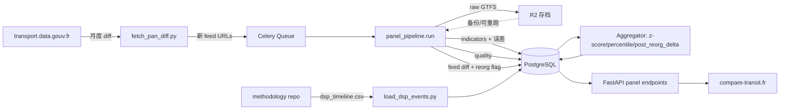

# compare-transit.fr — MVP 设计规范 **v0.2**

**版本**：0.2（战略转向：DSP / ouverture à la concurrence 主轴）
**前版**：[v0.1 — 2026-05-03](2026-05-03-compare-transit-mvp-design.md)
**日期**：2026-05-06
**作者**：Wei SI（与 Claude 协作）
**状态**：📝 Draft，待用户审阅
**实施前置**：本 spec 完成后通过 `superpowers:writing-plans` 技能产出实施计划

> **v0.2 主要变更**（详见 §19 决策日志末尾）：
> 1. 战略主轴从"媒体 + 顾问 productivity"转为 **DSP / ouverture à la concurrence 招投标场景的供给侧时序 reference**
> 2. 主受众从 B+A 改为 **B（顾问 CCTP）+ C（运营商 bid team）共主，A 媒体副**
> 3. 产品形态：**公开数据全免费 + Pro 卖工作流加速器**（数据永远不付费）
> 4. MVP 钩子集合定义：**reorg compare + audit-grade export + what-if isolation + lineage diff 表**
> 5. 新增 MVP 数据集：**dsp_timeline.csv**（30 个头部网络的 DSP 合约时间线 — T1 + T2 + 区域 R/I，由 methodology repo 维护）
> 6. methodology repo 升级为**社区数据公地**（formulas + dsp_timeline + aom_metadata + lineage_overrides）
> 7. 路线图 14 周 → **16 周**

---

## 1. 产品定位

### 1.1 一句话定位

> **法国 DSP 招投标场景下，每一份投标分析都必须基于的、唯一可信的供给侧时序 reference 数据集。**

### 1.2 详细定位

将 PAN（transport.data.gouv.fr）上 463 个法国 AOM 的 GTFS feed 历史数据，**按 DSP 合约时间线对齐**，标准化处理后呈现为可比较、可时序、可分享的网络指标面板与数据质量评分。

公开数据，免费访问；商业化通过 **Pro 工作流层**（what-if scenario、reorg compare 报告、audit-grade 导出、自定义 peer group、API），定价 €5–30K/年/团队。

### 1.3 三个产品轴

1. **供给侧时序分析轴** — 网络生产力、密度、覆盖、频率、可达性、模态混合
2. **数据质量评级轴** — 每个 GTFS feed 的合规度、完整度、可用性评分（带误差范围而非纯字母等级，因为 bid 引用要求可追溯）
3. **DSP 合约时间线轴** — 每个网络的运营商更替、合约起止、招标公告（30 个头部网络 MVP 覆盖：T1 + T2 + 区域 R/I）

三轴叉乘产生四象限叙事：
- "网络指标变化 + 运营商更替同步" → 招投标后果
- "数据质量差 + 看似强供给" → 数据失真，对 bid team 是风险标签
- "重组检测 + 无运营商变更" → AOM 主动重新设计

### 1.4 三类买家、三种使用方式

| 买家 | 使用方式 | 付费意愿 |
|---|---|---|
| **运营商 bid team**（Transdev、RATP Dev、Keolis 跨网竞标团队） | 摸不熟悉网络的运营史 + 与现任的信息不对称 | 高（€10–30K/年）|
| **DSP 顾问**（SETEC、Transamo、EGIS Rail、ITER、Systra） | 帮 AOM 写 CCTP + 帮 bidder 准备投标 | 中（€5–15K/年）|
| **AOM 内部分析师** | CCTP 自我准备 + 合约监督 | 低–中（€5K/年；销售周期长） |

### 1.5 与 GART 的关系

**不替代 GART 的法定地位** — GART 年报仍是 AOM 上报议会、申请 France Mobilités 经费的官方口径。compare-transit.fr 提供的是**更现代、更频繁、更透明的供给侧分析镜像，且按 DSP 周期对齐**：

- 让 AOM 与顾问能在 GART 周期外即时分析
- 让 GART 报告中的供给侧数字可被独立事实核查
- 让运营商 bid team 第一次拿到"接近内部数据精度"的公共数据

GART 覆盖的需求/财务/质量/人力指标我们**不重新发明**，留给 V2+ 通过 GART 历史数据 join 实现。

---

## 2. 战略决策（v0.2 已对齐）

| 维度 | 决策 | 备注 |
|------|------|------|
| **战略主轴** | DSP / ouverture à la concurrence 供给侧时序 reference | v0.2 转向（前版：媒体 + 顾问） |
| **主受众** | **B（顾问 CCTP）+ C（运营商 bid team）共主**；A（媒体）副 | v0.2 改 |
| **产品形态** | **公开数据全免费 + Pro 卖工作流**（数据永不付费） | v0.2 锁定 |
| **MVP 钩子集合** | reorg compare + audit-grade export + what-if isolation + lineage diff 表 | v0.2 锁定 |
| **DSP timeline** | MVP 含 30 个头部网络（T1 + T2 + 区域 R/I）手工 curate 合约时间线 | v0.2 新增 |
| **品牌定位** | **新主品牌**；当前 GTFS Miner 退化为 Pro 私有上传层 | 域名 `compare-transit.fr` |
| 网络覆盖 | 全部 463 个 PAN GTFS 数据集（2026-04 实测） | 不剔除小型网络 |
| 历史深度 | 每个网络拉到 PAN 上的最大可追溯深度 | 不设统一上限；早期发布者可达 2018 |
| 工程边界 | **MVP 仅宏观/派生指标 + DSP timeline + reorg detector**；不做线路谱系 | 谱系归 V1 / Pro 层 |
| 治理模式 | 开源方法论 + **社区数据公地** + 并行接洽 Cerema/GART | methodology repo 接受外部 PR |
| 商业模式 | MVP 全免费；V1 Pro 工作流加速器（€5–30K/年/团队） | 数据永远免费 |

---

## 3. MVP 范围

### 3.1 包含

**核心数据与指标**：
- ✅ 全部 PAN 上发布 GTFS 的法国 AOM（463 个数据集，2026-04 PAN 实测）
- ✅ 每个网络拉到最大可追溯历史深度（按 PAN 实际发布版本数）
- ✅ 38 个核心指标（35–40 个范围内）+ 派生层（z-score、percentile、YoY 变化）
- ✅ 数据质量评级体系（基于 MobilityData GTFS Validator + 法国特定规则；**带误差范围**而非单一字母等级）
- ✅ Peer group benchmark（基于人口/模态混合的预定义分层）

**v0.2 新增 / DSP 主轴专属**：
- ✅ **DSP timeline 数据集**（dsp_timeline.csv，30 个头部网络手工 curate — T1 + T2 + 区域 R/I；放在 methodology repo）
- ✅ **Reorg detector**（feed t vs t+1 的 route_id / stop_id 集合 Jaccard 距离阈值算法 → 自动标注重组事件）
- ✅ **Feed diff 表**（panel_feed_diffs：相邻 distinct feeds 之间的 stop / route 增删改集合）
- ✅ **Audit-grade export plumbing**（每个 indicator 值附带 source_feed_id、computed_at、methodology_commit_hash —— MVP 的所有 API 响应都带这三个字段）
- ✅ **What-if computation isolation**（indicator 计算函数与全局 DB 解耦，能独立调用一个 GTFS ZIP → 38 指标 dict）

**前端**：
- ✅ 网络详情页（每网络一个独立 SEO 友好 URL）+ DSP timeline overlay + reorg 事件标注
- ✅ 网络对比页（最多 5 个网络并列）
- ✅ 指标排行榜页（按指标查看全部网络排名）
- ✅ 数据质量排行榜
- ✅ **Reorg events 全国时间线页**（`/reorg-events`，本季度全国发生过重组的网络列表 — 媒体钩子）
- ✅ **网络历史 timeline 页**（`/network/[slug]/timeline`，DSP 合约 + GTFS 重组事件 + 指标突变三层叠加）

**治理**：
- ✅ 方法论开源仓库（GitHub）—— 升级为**社区数据公地**：
  - `indicators_formulas/` 每指标 Python 实现 + 文字描述
  - `dsp_timeline.csv` DSP 合约时间线
  - `aom_metadata.csv` AOM 元数据（人口、面积、tier、AOM_id）
  - `lineage_overrides.csv`（V1 启用，MVP 占位）
  - 接受外部 PR
- ✅ 月度自动更新（节奏待 Discovery Task D1 验证）

### 3.2 不包含

**核心 ID 对齐与谱系**：
- ❌ 站点级 fuzzy 匹配谱系（V1 引入；MVP 仅记录 feed diff，不暴露匹配关系）
- ❌ 线路 correspondance 收录（V1 引入；MVP 仅 reorg detector 标注重组发生）
- ❌ Referentiel ID 对齐（IDFM 等头部网络的 NeTEx referentiel ↔ GTFS stop_id 映射；V1+，详见 §21 调研）

**数据时序**：
- ❌ GTFS-RT 实时数据
- ❌ 多国扩展（仅法国）

**用户/账号**：
- ❌ 用户上传功能（在新品牌站不暴露；仅在 GTFS Miner Pro 域名下保留）
- ❌ 用户账号系统、付费墙（V1 引入，MVP 不需要）

**Pro 工作流**（V1 上线）：
- ❌ What-if scenario UI（架构钩子在 MVP，UI 在 V1）
- ❌ Reorg compare 详细报告 PDF（V1）
- ❌ Bulk export with audit trail UI（V1；架构 plumbing 在 MVP）
- ❌ Custom peer group（V1）
- ❌ 公开 API 产品（带 API key 鉴权、限速、API 文档站点、SDK — V1）

**指标**：
- ❌ LLM Agent 自然语言查询（V2）
- ❌ 自动化 PDF/PPT 报告导出（V1）
- ❌ AOM 后台（"修正我们网络数据"申诉 — V1）

**GART 完整指标谱中我们故意不覆盖的部分**（详见 §5.1 末尾 GART 覆盖矩阵）：
- ❌ **需求侧指标**（年客流、人均出行、占用率）：V2 通过 GART 历史数据 join
- ❌ **财务指标**（recettes、R/D、coût/voyage、Versement Mobilité）：V2 引入
- ❌ **服务质量指标**（régularité、disponibilité、satisfaction）：需 GTFS-RT；V2
- ❌ **人力指标**（effectifs、conducteurs、ETP）：不计划
- ❌ **容量绝对值**（places-km offertes）：MVP 用 `prod_peak_vehicles_needed` 替代
- ❌ **通勤 OD 覆盖**（`econ_commute_pair_cov`）：V1 通过 INSEE MOBPRO 集成实现

---

## 4. 受众与价值场景

### 4.1 主受众 #1 — B：顾问 CCTP / 投标准备

**Persona**：SETEC、Transamo、EGIS Rail、ITER、Systra 的中级到高级分析师，正在：
- (a) 帮 AOM 撰写 DSP 招标 CCTP（service de référence、KPI 设定、benchmark 引用）
- (b) 帮 bidder 准备投标响应（peer comparison、productivity benchmark）

**核心场景**：

1. **CCTP 撰写**：进站搜索"Bordeaux" → 详情页看 KCC、覆盖率、模态混合 + peer 对比 + 5 年趋势 + DSP timeline 注明"现合约 2017-09 至 2025-08"
2. **Peer 引用**：选 5 个 peer 网络对比 → 截图/复制数据到 CCTP 文档第三章 + 自动附 methodology commit hash 引用（V1 Pro 卖点）
3. **投标响应**：切到指标排行榜 → "哪些网络与 Bordeaux 在 KCC/人均上同档"
4. **历史诊断**：网络 timeline 页查"2018–今 Bordeaux 重组了几次？运营商更替对应 KCC 趋势？"

**MVP 成功指标**（B）：5 分钟完成本来要 2 天的 peer comparison + DSP context 整理。

### 4.2 主受众 #2 — C：运营商 bid team

**Persona**：Transdev / RATP Dev / Keolis 的跨网竞标团队中级到高级分析师，正在：
- (a) 评估是否进入某个 DSP 招标
- (b) 准备投标响应文件
- (c) 进入 due diligence 阶段后摸网络底细

**核心场景**：

1. **进入决策**：读 BOAMP 公告 → 来站搜索网络 → 5 分钟看清网络规模、历史趋势、peer 排名 → 决定是否进入投标
2. **bid 准备**：详情页 + reorg events + DSP timeline → 写"为什么我们能比现任做得更好"的论证段落
3. **due diligence**：对比"现任运营商任期内"vs"前任任期内"的指标变化（reorg compare 的 V1 Pro 卖点）
4. **bid 文件引用**：每张图都附 methodology hash 链接 → 经得起反质询

**MVP 成功指标**（C）：上线后 14 天内 ≥3 家运营商 bid team 团队成员注册"Pro 通知我"邮件表单（注册时勾选 "operator bid team" 角色）。

### 4.3 副受众 — A：媒体 virality

**Persona**：Le Monde Décodeurs、Mediacités、Libération、Mediapart 数据组的记者。

**核心场景**：

1. 阅读 GTFS 数据质量年度报告（产品方主动发布的 PR 文章）
2. 来站验证某条 finding（"30% 的 AOM GTFS 不合规"）
3. **DSP 透明度报道**：访问 `/reorg-events` 查"2024 年法国哪 17 个 AOM 做过大重组" → 找 outlier 做深度报道
4. 在文章里链接到具体网络详情页（`compare-transit.fr/network/<slug>`）

**MVP 成功指标**（A）：上线后 3 个月内被至少一篇主流媒体引用。

### 4.4 三级副向受众

| 受众 | 用途 |
|------|------|
| **AOM 内部分析师** | 政治辩护材料；议会汇报；预算论证；合约履约监督 |
| **Cerema / GART** | 现代化他们的方法论；潜在合作伙伴 |
| **学术研究者**（Université Gustave Eiffel、IRT SystemX） | 论文数据源 |
| **下游消费者**（Citymapper、Mappy、Google Maps、navitia.io） | 选择优先集成的 feed |

---

## 5. 指标体系

> **v0.2 变更**：38 个指标本身不变（对应 v0.1 §5.1）。新增 **DSP 视角优先级**标注（哪些指标在招投标场景下最先看），用于 §7 前端详情页的"DSP 视图"排版。

### 5.1 38 个核心指标 — DSP 视角优先级标注

DSP 视角下，bid team 第一眼最关心的 5 个指标（**优先 P0**）：

| ID | DSP 优先级 | 在 bid team 工作流中的意义 |
|----|---|---|
| `prod_kcc_year` | **P0** | 网络体量基线，所有成本估算的分母 |
| `prod_peak_vehicles_needed` | **P0** | 车队规模 → 人员、维修、depot 估算 |
| `freq_commercial_speed_kmh` | **P0** | 司机生产力 → 人力成本 |
| `prod_lines_count` + `prod_stops_count` | **P0** | 网络复杂度 |
| `cov_pop_300m` + `cov_pop_freq_300m` | **P0** | AOM 政治目标 → CCTP 中可能 KPI |

DSP 视角 P1 指标（次重要）：`prod_courses_day_avg`、`freq_peak_headway_median`、`struct_modal_mix_*`、`acc_wheelchair_stops_pct`、`dq_*` 全套。

DSP 视角 P2 指标（背景）：`struct_route_directness`、`struct_multi_route_stops_pct`、`cov_equity_gini`、`env_co2_year_estimated`。

完整 38 指标的公式与单位见下表（与 v0.1 §5.1 一致）：

#### A. 生产力（8）

| ID | 名称 | 单位 | 公式 | DSP 优先 |
|----|------|------|------|---|
| `prod_kcc_year` | 年度 KCC（商业里程） | km | Σ trips × Σ segments × haversine × days_active | **P0** |
| `prod_courses_day_avg` | 日均班次数 | trips/day | Σ trips × days_active / total_days | P1 |
| `prod_peak_hour_courses` | 峰时班次数 | trips/h | trips departing during HPM/HPS window | P1 |
| `prod_service_amplitude` | 服务时段宽度 | h | max(stop_time) − min(stop_time) | P1 |
| `prod_lines_count` | 线路数 | count | count(distinct route_id) — GART 对齐 | **P0** |
| `prod_stops_count` | 站点数 | count | count(distinct stop_id where location_type=0) — GART 对齐 | **P0** |
| `prod_network_length_km` | 网络商业线路长度 | km | sum of unique geographic segments — GART 对齐 | P1 |
| `prod_peak_vehicles_needed` | 高峰所需车辆数 | count | Σ_route ⌈peak_round_trip_time / peak_headway⌉ | **P0** |

#### B. 密度（4）

| ID | 名称 | 单位 | 公式 | DSP 优先 |
|----|------|------|------|---|
| `dens_stops_km2` | 站点密度 | stops/km² | count(stops) / AOM 面积 | P2 |
| `dens_lines_100k_pop` | 线路人均密度 | lines/100K | count(lines) / population × 100K | P1 |
| `dens_kcc_capita` | 人均 KCC | km/capita | prod_kcc_year / population | P1 |
| `dens_kcc_km2` | 单位面积 KCC | km/km² | prod_kcc_year / AOM 面积 | P2 |

#### C. 网络结构（7）

| ID | 名称 | 单位 | 公式 | DSP 优先 |
|----|------|------|------|---|
| `struct_modal_mix_bus` | 公交占比 | % | trips with route_type=3 / total | P1 |
| `struct_modal_mix_tram` | 有轨电车占比 | % | route_type=0 | P1 |
| `struct_modal_mix_metro` | 地铁占比 | % | route_type=1 | P1 |
| `struct_modal_mix_train` | 火车占比 | % | route_type=2 | P1 |
| `struct_peak_amplification` | 峰平放大率 | 倍 | peak hour trips / off-peak hour trips | P2 |
| `struct_multi_route_stops_pct` | 多线换乘点比例 | % | stops served by ≥2 routes / total stops | P2 |
| `struct_route_directness` | 线路曲折度（中位）| ratio | median over routes of (actual / great_circle) | P2 |

#### D. 覆盖（6）

| ID | 名称 | 单位 | 公式 | DSP 优先 |
|----|------|------|------|---|
| `cov_pop_300m` | 300m 圈人口覆盖率 | % | INSEE 200m 网格 ∩ stops 300m buffer / total pop | **P0** |
| `cov_pop_freq_300m` | 高频服务覆盖率 | % | 同上但 stops 必须有 ≤10min 峰时间隔 | **P0** |
| `cov_surface_300m` | 面积覆盖率 | % | (300m buffer ∩ AOM polygon) area / AOM area | P1 |
| `cov_median_walk` | 站点中位步行距离 | m | INSEE 网格中心到最近站点的中位数 | P1 |
| `cov_pop_weighted_walk` | 人口加权步行距离 | m | Σ(IRIS pop × min_walk) / Σ pop | P1 |
| `cov_equity_gini` | IRIS 覆盖率基尼系数 | 0–1 | Gini 系数 over per-IRIS coverage rate | P2 |

#### E. 频率与速度（4）

| ID | 名称 | 单位 | 公式 | DSP 优先 |
|----|------|------|------|---|
| `freq_peak_headway_median` | 峰时中位间隔 | min | median over lines of (peak_hour_trips → headway) | P1 |
| `freq_high_freq_lines_pct` | 高频线路比例 | % | lines with peak headway ≤10 min / total lines | P1 |
| `freq_daily_service_hours` | 日均服务时长 | h | mean(amplitude) over weekdays | P1 |
| `freq_commercial_speed_kmh` | 商业速度 | km/h | Σ trip_distance / Σ trip_duration — GART 对齐 | **P0** |

#### F. 可达性（2）

| ID | 名称 | 单位 | 公式 | DSP 优先 |
|----|------|------|------|---|
| `acc_wheelchair_stops_pct` | 轮椅可达站点比例 | % | stops where wheelchair_boarding=1 / total | P1 |
| `acc_wheelchair_trips_pct` | 轮椅可达班次比例 | % | trips where wheelchair_accessible=1 / total | P1 |

#### G. 数据质量（6）

| ID | 名称 | 单位 | 公式 | DSP 优先 |
|----|------|------|------|---|
| `dq_validator_errors` | Validator 错误数 | count | MobilityData validator 严重级别 ERROR | P1 |
| `dq_validator_warnings` | Validator 警告数 | count | severity WARNING | P1 |
| `dq_field_completeness` | 字段完整度 | 0–100 | 必填字段非空率加权平均 | P1 |
| `dq_coord_quality` | 坐标合理性 | % | stops within AOM polygon ∩ within France bbox | P1 |
| `dq_route_type_completeness` | route_type 完整度 | % | 1 − (rows defaulted to 3) | P1 |
| `dq_freshness` | 数据新鲜度 | days | now − last_published_date | P1 |

**质量综合分**（派生）：每个指标 0–100，按如下权重加权：

```
overall_quality_score =
    0.25 × dq_validator_errors_normalized
  + 0.20 × dq_field_completeness
  + 0.15 × dq_coord_quality
  + 0.15 × dq_route_type_completeness
  + 0.15 × dq_freshness_score
  + 0.10 × dq_validator_warnings_normalized
```

**v0.2 变更**：除了字母等级（A+ … F），每个 indicator 值在 API 响应中**必须附带 ±误差范围**（基于 `dq_*` 6 项的传播）。bid team 引用时需要这个误差范围以经得起反质询。具体公式见附录 A。

#### H. 环境（1）

| ID | 名称 | 单位 | 公式 | DSP 优先 |
|----|------|------|------|---|
| `env_co2_year_estimated` | 估算年 CO2 排放 | tCO2/year | Σ (KCC_by_route_type × ADEME 排放因子_by_route_type) | P2 |

**披露要求**（写入方法论 GitHub README）：
- 排放因子来源：**ADEME Base Carbone v23+**（2026 版）
- 假设：按 route_type 分模式平均，**不**反映具体车型
- 标识：UI 上必须显示"Estimation order-of-magnitude，不可用于法律 GHG 报告"
- 误差量级：±30% 对柴油主导网络；±50% 对混合电动网络
- 公式与排放因子表完整发布在 `compare-transit/methodology` 仓库 `co2_methodology.md`

### 5.1bis GART 指标覆盖矩阵

（与 v0.1 §5.1bis 完全一致，未列出以节省篇幅；见 [v0.1 §5.1bis](2026-05-03-compare-transit-mvp-design.md#51bis-gart-指标覆盖矩阵)）

### 5.2 派生指标层

每个核心指标产生三个派生值：

1. **`<id>_zscore`** — 在 peer group 内的 z-score
2. **`<id>_percentile`** — 在 peer group 内的百分位排名
3. **`<id>_yoy_delta`** — 与 12 个月前同指标的变化率（仅当历史可达 ≥12 个月时计算）

**v0.2 新增派生**：

4. **`<id>_post_reorg_delta`** — 检测到重组事件 t 后第一个 feed vs 重组前最后一个 feed 的变化率（**核心 DSP 故事钩子**）

### 5.3 Peer Group 定义（MVP 简化版）

（与 v0.1 §5.3 完全一致；7 tier 分层 T1/T2/T3/T4/T5/R/I）

---

## 6. 数据架构

### 6.1 数据源

| 来源 | 用途 | 访问方式 | 缓存策略 |
|------|------|---------|---------|
| **transport.data.gouv.fr (PAN)** | GTFS feed + 历史版本目录 | `/api/datasets`、`/api/datasets/{datagouv_id}`、`/datasets/{short_id}/resources_history_csv` | 月度 diff；feed 内容缓存到 R2；**强制 dedup by `feed_start_date`** |
| **INSEE** | 人口数据（commune + IRIS + 200m 网格） | data.gouv.fr 数据集下载 | 年度更新；内置随版本 |
| **IGN ADMIN-EXPRESS** | AOM/PTU/commune 行政边界 | data.gouv.fr 下载 | 年度更新；内置随版本 |
| **Cerema MOBI** | AOM 元数据（人口、面积、tier） | 公开 CSV | 年度更新 |
| **MobilityData GTFS Validator** | 数据质量验证 | Java CLI 调用 | 每 feed 一次 |
| **🆕 dsp_timeline.csv** | 30 个头部网络的 DSP 合约时间线（T1 + T2 + 区域 R/I） | methodology repo 手工 curate | 每月 review；接受外部 PR |
| **🆕 BOAMP / TED**（V1 自动化） | DSP 招标公告原始数据 | 公开 RSS / API | V1 引入；MVP 不集成 |

**v0.2 新增 — DSP timeline 数据源**

dsp_timeline.csv 的 schema（详见附录 B §22）：
```
network_slug,         -- 对应 panel_networks.slug
event_type,           -- 'tender_published' | 'tender_awarded' | 'contract_started' | 'contract_ended' | 'amendment'
event_date,           -- ISO 8601
operator_before,      -- 该事件前的运营商
operator_after,       -- 该事件后的运营商（合并/拆分时可多个）
contract_id,          -- 内部 ID
contract_value_eur,   -- 已知则填，未知留空
boamp_url,            -- BOAMP 公告 URL（如有）
notes,                -- 自由文本注释
source,               -- 'BOAMP' | 'GART' | 'press' | 'AOM_publication' | 'manual'
contributor,          -- GitHub username 或邮件 hash
```

**关键 PAN 接入策略**（v0.1 已验证，2026-04 实测保留）：

PAN 的 `resources_history_csv` 包含**大量元数据重复**：同一 GTFS feed 因 metadata 微调被反复登记为新 resource version。SNCF 单网络 raw history 7,434 行，但去重后真正不同的 feed 数量低一个量级。

**Dedup 流程**（与 v0.1 一致，详见 v0.1 §6.1）：
1. 拉 `resources_history_csv` 得到该网络全部 raw 历史行
2. 每行 `payload.zip_metadata` 含每个 ZIP 内文件的 sha256
3. 取 `feed_info.txt` 的 sha256 作为 dedup key（fallback：`calendar.txt` → `calendar_dates.txt`）
4. 对每个独特 sha，用 `remotezip` HTTP Range 仅下载 `feed_info.txt`，解析 `feed_start_date`
5. 同一 `feed_start_date` 保留 `inserted_at` 最新的 resource

**实测数据规模**（PAN 2026-04 全网扫描 — 与 v0.1 一致）：
- GTFS 数据集总数 463；有非空历史的数据集 455
- Raw history rows 总数 122,558；dedup 后 distinct feeds 估算 ~30,000–35,000
- 全量归档大小估算 ~25–35 GB 压缩
- 处理时间估算 ~250 CPU 小时单线程；4 核并行 ~60 小时

### 6.2 Pipeline — 局部复用方案

```
panel_pipeline/run.py（新代码 ~300 行 — v0.1 ~250 行 + reorg detector ~50 行）
  │
  ├─ [复用] gtfs_core.gtfs_utils.rawgtfs_from_zip()
  ├─ [复用] gtfs_core.gtfs_norm.gtfs_normalize()
  ├─ [复用] gtfs_core.gtfs_norm.ligne_generate()
  ├─ [跳过] gtfs_core.gtfs_spatial.*（聚类）
  ├─ [跳过] gtfs_core.gtfs_generator.itineraire_*
  ├─ [跳过] gtfs_core.gtfs_generator.sl_generate
  ├─ [复用] gtfs_core.gtfs_generator.service_date_generate()
  ├─ [复用] gtfs_core.gtfs_generator.service_jour_type_generate()
  │
  ├─ [NEW] panel_pipeline.indicators.compute()
  │      ├─ panel_pipeline.indicators.productivity.*
  │      ├─ panel_pipeline.indicators.density.*
  │      ├─ panel_pipeline.indicators.structure.*
  │      ├─ panel_pipeline.indicators.coverage.*
  │      ├─ panel_pipeline.indicators.frequency.*
  │      ├─ panel_pipeline.indicators.accessibility.*
  │      └─ panel_pipeline.indicators.quality.*
  │
  ├─ [NEW] panel_pipeline.geo.*  （INSEE/IGN 数据加载、AOM 边界 join、IRIS 200m 覆盖率计算）
  │
  └─ [NEW v0.2] panel_pipeline.diff.*
         ├─ feed_diff(feed_t, feed_t_plus_1) → stop_added/removed/modified, route_added/...
         ├─ reorg_detect(feed_t, feed_t_plus_1) → bool + Jaccard scores
         └─ persist to panel_feed_diffs / panel_reorg_flags
```

**v0.2 新增 — What-if 隔离要求**：

`panel_pipeline.indicators.compute()` 必须满足：
- 输入：单一 GTFS ZIP（路径或字节流）+ AOM metadata（population, area_km2, polygon）
- 输出：38 indicators dict + 派生（zscore/percentile 留空，因为 peer group 在 DB 中）
- **不**触发 DB 写入；不依赖全局状态；纯函数语义（同输入 → 同输出，模 ADEME 因子表版本）

这是 V1 Pro "what-if scenario simulator" 的架构基础。

**单 feed 处理时间预算**：与 v0.1 一致（中型 ~30s；IDFM 规模 ~1–2min；全量回填 ~250 CPU 小时单线程；4 核 ~63 小时）。

### 6.3 存储模型（PostgreSQL）

#### 6.3.1 v0.1 已有的表（保留）

```sql
-- 网络注册表
panel_networks (
  network_id           uuid PK,
  slug                 varchar UNIQUE,
  pan_dataset_id       varchar UNIQUE,
  display_name         varchar,
  aom_id               varchar,
  tier                 varchar,
  population           integer,
  area_km2             numeric,
  first_feed_date      date,
  last_feed_date       date,
  history_depth_months integer,
  created_at           timestamptz,
  updated_at           timestamptz
)

-- Feed 版本注册表（dedup 后 distinct feeds）
panel_feeds (
  feed_id              uuid PK,
  network_id           uuid FK,
  pan_resource_id      varchar,
  pan_resource_history_id varchar,
  published_at         timestamptz,
  feed_start_date      date,
  feed_end_date        date,
  feed_info_sha256     varchar,
  feed_info_source     varchar,
  gtfs_url             varchar,
  r2_path              varchar,
  checksum_sha256      varchar,
  filesize             integer,
  process_status       varchar,
  process_duration_s   numeric,
  error_message        text,
  created_at           timestamptz,
  UNIQUE (network_id, feed_start_date)
)

-- 指标值（长格式，便于扩展）
panel_indicators (
  feed_id              uuid FK,
  indicator_id         varchar,
  value                double precision,
  unit                 varchar,
  error_margin_pct     numeric,                  -- 🆕 v0.2：基于 dq_* 的误差传播
  computed_at          timestamptz,
  methodology_commit   varchar,                  -- 🆕 v0.2：methodology repo HEAD commit hash
  PRIMARY KEY (feed_id, indicator_id)
)

-- 派生指标缓存
panel_indicators_derived (
  feed_id              uuid FK,
  indicator_id         varchar,
  zscore               double precision,
  percentile           numeric,
  yoy_delta_pct        double precision,
  post_reorg_delta_pct double precision,         -- 🆕 v0.2
  peer_group_size      integer,
  computed_at          timestamptz,
  PRIMARY KEY (feed_id, indicator_id)
)

-- 数据质量详情
panel_quality (
  feed_id              uuid FK PRIMARY KEY,
  validator_errors     jsonb,
  overall_grade        varchar,
  overall_score        numeric,
  computed_at          timestamptz
)

-- Peer group 定义
panel_peer_groups (
  group_id             varchar PRIMARY KEY,
  display_name         varchar,
  definition           jsonb,
  member_count         integer
)
```

#### 6.3.2 v0.2 新增的表

```sql
-- 🆕 Feed 之间的 stop/route diff（lineage 钩子，MVP 不暴露 UI）
panel_feed_diffs (
  diff_id              uuid PK,
  network_id           uuid FK,
  feed_from_id         uuid FK panel_feeds,      -- t
  feed_to_id           uuid FK panel_feeds,      -- t+1
  stops_added          jsonb,                    -- list of stop_id
  stops_removed        jsonb,
  stops_modified       jsonb,                    -- {stop_id: {field: [old, new]}}
  routes_added         jsonb,
  routes_removed       jsonb,
  routes_modified      jsonb,
  stop_jaccard         numeric,                  -- 0-1
  route_jaccard        numeric,                  -- 0-1
  computed_at          timestamptz,
  UNIQUE (feed_from_id, feed_to_id)
)

-- 🆕 Reorg 检测标志
panel_reorg_flags (
  network_id           uuid FK,
  feed_to_id           uuid FK panel_feeds,      -- 重组首个 feed
  reorg_detected       boolean,
  reorg_severity       varchar,                  -- 'minor' | 'major' | 'massive'
  stop_jaccard         numeric,
  route_jaccard        numeric,
  threshold_version    varchar,                  -- detector 算法版本
  notes                text,                     -- 可由 AOM 通过 V1 申诉机制填写
  detected_at          timestamptz,
  PRIMARY KEY (network_id, feed_to_id)
)

-- 🆕 DSP 合约时间线事件（从 dsp_timeline.csv 加载）
panel_dsp_events (
  event_id             uuid PK,
  network_id           uuid FK,
  event_type           varchar,                  -- enum: tender_published / tender_awarded / contract_started / contract_ended / amendment
  event_date           date,
  operator_before      varchar,
  operator_after       varchar,
  contract_id          varchar,
  contract_value_eur   numeric,
  boamp_url            varchar,
  notes                text,
  source               varchar,                  -- enum: BOAMP / GART / press / AOM_publication / manual
  contributor          varchar,
  csv_row_hash         varchar,                  -- 用于 reload 检测
  imported_at          timestamptz
)
```

### 6.4 数据流



---

## 7. 前端架构

### 7.1 技术栈

（与 v0.1 §7.1 一致：Vite + React 18 + TS + vike + Tailwind v4 + shadcn/ui + TanStack Query + Recharts + MapLibre GL JS + satori + Cloudflare Pages）

### 7.2 路由与页面

| 路由 | 页面 | 渲染策略 | v0.2 |
|------|------|---------|---|
| `/` | 首页（hero + featured + browse） | SSG | |
| `/network/[slug]` | 网络详情页（38 指标 + history + peer + quality） | SSG（构建时 prerender 463 个） | |
| `/network/[slug]/timeline` | 网络历史时间线（DSP 合约 + reorg 事件 + 指标突变三层叠加） | SSG | **🆕** |
| `/compare?networks=lyon,bordeaux,toulouse` | 网络对比页（最多 5 个） | CSR（动态 query） | |
| `/indicators/[indicator_id]` | 指标排行榜 | SSG | |
| `/quality` | 数据质量国家级仪表板 | SSG | |
| `/quality/[slug]` | 单网络数据质量详情 | SSG | |
| `/reorg-events` | **全国 reorg 事件时间线**（媒体钩子） | SSG | **🆕** |
| `/methodology` | 方法论文档（指标公式 + 数据源 + GitHub 链接 + dsp_timeline 贡献指南） | SSG | |
| `/about` | 关于产品 | SSG | |
| `/og/[slug].png` | 社交分享 OG 图（动态） | Cloudflare Worker | |

### 7.3 信息架构（关键页面）

#### 7.3.1 网络详情页 `/network/lyon` — v0.2 新视图

```
┌─────────────────────────────────────────────────────────────┐
│ [Header: Logo · Nav · Search · Language switch · Pro link]  │
├─────────────────────────────────────────────────────────────┤
│ [Network Header]                                             │
│   Métropole de Lyon — TCL                                    │
│   T1 大都市圈含地铁  ·  人口 1,420K  ·  面积 538 km²        │
│   📅 Données depuis 2018 (28 trimestres)                     │
│   [Quality Badge: A− (87 ±4)] · [Last update: 2026-04-01]   │
│   🆕 [DSP: Keolis 2017→2025] · [⚠ Reorg 2024-09]            │
├─────────────────────────────────────────────────────────────┤
│ [DSP Timeline Lane — 🆕]                                     │
│   2017 ───── Keolis ─────── 2024-09 ⚠ Reorg ─── 2025? ──→  │
│   [事件点击展开 BOAMP 链接 + 影响指标]                       │
├─────────────────────────────────────────────────────────────┤
│ [Indicator Grid — 7 categories × cards，DSP P0 高亮]         │
│ ┌────────────────┐ ┌────────────────┐ ┌────────────────┐   │
│ │ ⭐ KCC/year     │ │ ⭐ Peak vehicles│ │ ⭐ Comm. speed │   │
│ │ 24.3M km ±2%   │ │ 412 ±3%        │ │ 18.4 km/h ±1%  │   │
│ │ ↑ 4.2% YoY     │ │ #2 / 5 (T1)    │ │ z=+0.8         │   │
│ │ 🔄 −3% post-2024│ │ z=+1.4         │ │                │   │
│ └────────────────┘ └────────────────┘ └────────────────┘   │
├─────────────────────────────────────────────────────────────┤
│ [Peer Comparison Table]                                      │
├─────────────────────────────────────────────────────────────┤
│ [History Charts — 多指标时序，重组事件灰柱标注]              │
│   [ KCC 时序 2018–2026                                   ]  │
│   [   ▒ 2024-09 重组（route_jaccard=0.27）                ] │
│   [ Coverage 时序 2018–2026                              ]  │
├─────────────────────────────────────────────────────────────┤
│ [Data Quality Report]  [methodology hash + permalinks]       │
├─────────────────────────────────────────────────────────────┤
│ [Methodology drawer / Share / Pro upgrade]                   │
└─────────────────────────────────────────────────────────────┘
```

#### 7.3.2 全国 Reorg 事件页 `/reorg-events` — v0.2 NEW

国家级时间轴：
- 横轴：年/季度
- 每个 reorg 事件点：网络名、严重度（minor/major/massive）、Jaccard 分数、是否同期有运营商更替
- 过滤器：tier、严重度、是否伴随 DSP event、年份范围
- 媒体角度："2024 年法国 17 个 AOM 做过 major+ 重组"

### 7.4 组件层（Atomic Design）

延续现有 `frontend/src/components/atoms/molecules/organisms/templates/` 结构。

**v0.1 已有的新增组件**（保留）：
- atoms：`IndicatorBadge`、`QualityBadge`、`TrendArrow`、`PercentileRank`、`HistoryDepthBadge`
- molecules：`IndicatorCard`、`QualityCard`、`HistorySparkline`
- organisms：`NetworkHeader`、`IndicatorGrid`、`PeerComparisonTable`、`HistoryChart`、`DataQualityReport`、`MethodologyDrawer`、`NetworkSearchBar`
- templates：`NetworkDetailTemplate`、`BrowseTemplate`、`HomeTemplate`

**v0.2 新增组件**：
- atoms：`OperatorBadge`（运营商色块）、`ReorgSeverityBadge`（minor/major/massive）、`ErrorMarginBadge`（±x%）
- molecules：`DspEventChip`（单个合约事件点）、`ReorgFlagInline`（重组提示条）
- organisms：`DspTimelineLane`（详情页 DSP 时间线）、`ReorgDetectorBadge`（顶部标志）、`FeedDiffViewer`（V1 内部用，MVP 占位）、`NationalReorgTimeline`（全国页主图）
- templates：`NetworkTimelineTemplate`、`ReorgEventsTemplate`

---

## 8. API 契约

所有 panel 端点在现有 FastAPI 项目下的 `/api/v1/panel/*` 路径。

> **范围说明**：本节描述的是**前端访问的后端 endpoints**，公开无鉴权。它们不是"API 产品"（带 API key、限速、文档站、SDK 等），那个是 V1 内容。如果第三方发现并直接调用这些 endpoints，我们不阻止也不承诺稳定。

### 8.1 公开端点（无认证，CORS 全开）

#### v0.1 已有（保留）：

| Method | Path | 描述 |
|--------|------|------|
| GET | `/api/v1/panel/networks` | 列表（支持 tier/region 过滤、分页） |
| GET | `/api/v1/panel/networks/{slug}` | 单网络详情 |
| GET | `/api/v1/panel/networks/{slug}/history` | 时序：所有指标的历史值 |
| GET | `/api/v1/panel/networks/{slug}/peers` | 同 tier peers + 在每个指标上的排名 |
| GET | `/api/v1/panel/networks/{slug}/quality` | 数据质量详情 |
| GET | `/api/v1/panel/indicators/{indicator_id}/ranking` | 全部网络在该指标上的排行 |
| GET | `/api/v1/panel/quality/ranking` | 全部网络的质量评级排行 |
| GET | `/api/v1/panel/peer-groups` | tier 定义元数据 |
| GET | `/api/v1/panel/og/{slug}.png` | OG 图片（302 重定向到 Cloudflare Worker） |

#### v0.2 新增：

| Method | Path | 描述 |
|--------|------|------|
| GET | `/api/v1/panel/networks/{slug}/dsp-events` | 单网络 DSP 合约时间线 |
| GET | `/api/v1/panel/networks/{slug}/reorg-events` | 单网络重组检测事件 |
| GET | `/api/v1/panel/networks/{slug}/feed-diff?from=&to=` | 两个 feed 之间的 stop/route diff（MVP 内部用，V1 暴露 UI） |
| GET | `/api/v1/panel/dsp-events/global?year=&type=&tier=` | 全国 DSP 事件时间轴（媒体页支撑） |
| GET | `/api/v1/panel/reorg-events/global?year=&severity=&tier=` | 全国 reorg 事件时间轴 |

### 8.2 响应规范

- 全部 JSON，UTF-8
- 时间戳 ISO 8601
- 数值字段：`null` 表示"无可用数据"，**不**用 `-1` 或 `0` 填充
- 错误格式：`{"error": {"code": "...", "message": "..."}}`
- Cache-Control：所有公开端点 `public, max-age=3600, s-maxage=86400`（CDN 1 天）

**v0.2 新增**：每个 indicator value 必须以下列结构返回（audit-grade plumbing）：

```json
{
  "value": 24300000,
  "unit": "km/year",
  "error_margin_pct": 2.1,
  "source_feed_id": "uuid-...",
  "computed_at": "2026-04-01T12:00:00Z",
  "methodology_commit": "a3f2c1d",
  "methodology_url": "https://github.com/.../blob/a3f2c1d/indicators_formulas/prod_kcc_year.py"
}
```

---

## 9. 治理与方法论

### 9.1 GitHub 开源仓库 — **升级为社区数据公地**

新建 `compare-transit/methodology` 仓库，公开：

```
compare-transit/methodology/
├── indicators_formulas/         # 38 指标的 Python 实现 + 文字描述
│   ├── prod_kcc_year.py
│   ├── prod_kcc_year.md
│   └── ...
├── data/
│   ├── dsp_timeline.csv         # 🆕 DSP 合约时间线（30 个 T1+T2 网络起手）
│   ├── aom_metadata.csv         # AOM 人口、面积、tier、AOM_id
│   └── lineage_overrides.csv    # 🆕 V1 启用，MVP 留空 schema 占位
├── methodology/
│   ├── README.md
│   ├── co2_methodology.md
│   ├── error_propagation.md     # 🆕 误差范围公式
│   └── reorg_detector.md        # 🆕 reorg 阈值与算法
├── CONTRIBUTING.md               # 🆕 PR 接受规则
└── CHANGELOG.md                  # 每次方法论修订打 tag
```

**社区贡献流程**：
- 任何人可以 PR 修改 dsp_timeline.csv（提供 BOAMP URL 或 AOM 公告 URL 作为来源）
- 维护者审核：来源是否可验证、字段格式正确、不与现有事件冲突
- 接受后 merge → 下次 cron 重新加载 panel_dsp_events 表
- AOM 自己也可以贡献"我们网络的合约时间线"（V1 申诉机制的轻量前置）

每个网络详情页的指标卡片底部链接到对应公式的 GitHub 永久链接（commit hash 锁定的 URL）。

### 9.2 Cerema / GART 接洽计划

并行而非阻塞 MVP：
- **Week 4**：邮件主动接触 Cerema 数据团队 + GART 研究主任，**重点讲"开源数据公地"叙事**
- **Week 8**：演示 alpha 版本，邀请方法论 review；邀请共同维护 dsp_timeline.csv
- **Week 12**：根据反馈调整；争取联合署名或公开 endorsement
- 即使无背书，MVP 仍按计划上线

**v0.2 新论点**：methodology repo 升级为社区数据公地，给 Cerema/GART 一个**主动的合作位置**——他们的 GART 年报数据可以 reverse-publish 进我们的 repo，作为公开 fact-checking 基础。

### 9.3 公开 vs 私有数据政策

- 全部 PAN 已公开数据，按公开数据处理
- AOM 申诉机制（V1）：AOM 可以提交 context 注释（"2023 年因施工临时调整"），不可以删除数据
- 永远展示**相对自身历史**和**相对 peer 平均值**两条线，不做"最差 N 名"类聚合视图
- **v0.2**：对运营商而言同理——网络数据归属 AOM，运营商无权删除；但运营商可通过 V1 申诉机制提交 context 注释（"我们任期内的指标变化由 X 政策驱动"）

---

## 10. 商业模式 — **v0.2 重写**

### 10.1 MVP 阶段（不分级）

全部免费、无认证、无墙、无限速；唯一的"商业基础设施"是站点底部一个**带角色选择**的"Pro 通知我"邮箱收集表单：

```
[ ] AOM staff
[ ] Tender consultant (SETEC/Transamo/EGIS Rail/ITER/Systra/...)
[ ] Operator bid team (Transdev/RATP Dev/Keolis/...)
[ ] Journalist
[ ] Other
```

收到的角色分布是 V1 Pro 定价与功能优先级的输入。

### 10.2 V1（launch + 3 月）— Pro 工作流加速器

| 套餐 | 价格 | 内容 |
|------|------|------|
| **Free** | €0 | 全部数据访问、详情页、对比、排行榜、reorg events、DSP timeline；API 限速（100 req/h） |
| **Pro Consultant** | €5–15K/年/seat | + What-if scenario simulator、reorg compare 报告 PDF、custom peer group、audit-grade Excel 导出 |
| **Pro Operator** | €15–30K/年/团队 | Consultant 全部 + 私有 GTFS 上传 + bulk export 全数据集 + API 提速（1000 req/h）+ 优先支持 |
| **Enterprise** | 定制 | Operator 全部 + 白标、本地部署、SLA、API 无限速、咨询时长 |

**v0.2 关键定价原则**：
- **数据本身永远免费、永远公开**（开源数据公地承诺）
- Pro 卖的是**工作流稀缺度**：what-if 模拟器、reorg compare 报告、自定义 peer group、audit 导出
- Enterprise 卖的是**集成与服务**

### 10.3 V1 Pro 功能依赖的 MVP 钩子（必须 MVP 落地）

| Pro 功能 | MVP 钩子 |
|---|---|
| **What-if simulator** | indicator 计算函数纯函数化（§6.2）；输入 ZIP → 输出 dict；不依赖全局状态 |
| **Reorg compare 报告** | panel_feed_diffs 表 + panel_reorg_flags 表 + post_reorg_delta_pct 派生 |
| **Audit-grade export** | 每个 indicator 值带 source_feed_id + computed_at + methodology_commit |
| **Custom peer group** | peer_group_id 字段在派生计算中可参数化 |
| **API 提速** | API 层有 rate limit middleware（即使 MVP 无 key，结构就位） |

---

## 11. 工程契约 — 双管线 KCC 一致性

（与 v0.1 §11 完全一致，未变更）

**问题**：公开层精简管线和 Pro 层完整管线必须在共有指标（网络级 KCC、班次数等）上数值一致，否则用户在两侧看到差异会瞬间失去信任。

**契约测试**（CI 必跑）：

```python
@pytest.mark.parametrize("fixture", ["sem", "solea", "ginko"])
def test_kcc_equivalence(fixture):
    full_results = run_worker_pipeline(fixture)
    full_kcc = full_results["F_3_KCC_Lignes"]["kcc"].sum()
    panel_indicators = panel_pipeline.run(fixture)
    panel_kcc = panel_indicators["prod_kcc_year"]
    assert abs(full_kcc - panel_kcc) / full_kcc < 0.001
```

**共有指标契约清单**（CI 检测）：
- `prod_kcc_year` ↔ `Σ F_3_KCC_Lignes.kcc`
- `prod_courses_day_avg` ↔ `Σ F_1_Nombre_Courses_Lignes.courses / total_days`
- 模态混合（route_type 分布）
- HPM/HPS 班次数

任何一项失败 → CI 红，blocker。

---

## 12. Discovery Tasks（spec → implementation 之间的探索）

### Task D1：PAN 历史数据 + 更新节奏研究

（与 v0.1 一致；已完成于 [2026-05-03 D1 报告](2026-05-03-pan-history-discovery.md)）

### Task D2：INSEE/IGN 数据集成验证

（与 v0.1 一致）

### Task D3：MobilityData GTFS Validator 集成

（与 v0.1 一致）

### Task D4：双管线契约的 KCC 等价性验证

（与 v0.1 一致；已完成于 commit ac9e9f9）

### Task D5：DSP timeline curation pilot — **v0.2 新增**

**目标**：验证手工 curate 的可行性与工作量。

**步骤**：
1. 选 5 个 T1+T2 网络（Lyon TCL、Bordeaux TBM、Strasbourg CTS、Nantes TAN、Toulouse Tisséo）
2. 对每个网络，从 BOAMP + GART 年报 + 行业新闻收集过去 8 年 DSP 事件
3. 编写 dsp_timeline.csv 30+ 条事件
4. 测算工作量（实际 min/事件、最难事件类型）
5. 输出 `docs/superpowers/specs/2026-05-XX-dsp-timeline-discovery.md`

**验收**：
- 5 网络 DSP timeline 完整入库
- 工作量推算到 30 网络 ≤ 16 小时一次性
- 至少 1 个事件被运营商或 AOM 验证（私下沟通）
- 给出"最难事件类型"清单（指导 V1 自动化优先级）

### Task D6：Reorg detector 阈值调优 — **v0.2 新增**

**目标**：确定 stop_jaccard / route_jaccard 的 minor / major / massive 阈值，并验证 UI 表现。

**步骤**：
1. 在已知有重组的网络（Bordeaux 2024、Toulouse 2024、Nantes 2023）上跑 detector
2. 在已知无重组的网络（Strasbourg 2018-2024）上跑 detector，验证假阳性率
3. 调阈值，输出推荐：minor (`route_jaccard ∈ [0.7, 0.85]`)、major (`[0.5, 0.7]`)、massive (`<0.5`)
4. UI 测试：在 history chart 上叠加灰柱，看是否帮助理解 vs 噪声

**验收**：
- 阈值推荐写入 methodology/reorg_detector.md
- 至少 5 个真重组、5 个非重组的标注样本入库
- 假阳性率 < 5%、假阴性率 < 10%

---

## 13. 风险与缓解

| 风险 | 概率 | 影响 | 缓解 |
|------|------|------|------|
| AOM 政治反弹（"我们网络被排倒数"） | 高 | 中 | 不做"最差 N 名"视图；只展示 percentile + 历史趋势；提供 V1 context 注释机制 |
| 方法论被攻击 | 中 | 中 | 全开源 + 双口径并列 + 邀请 Cerema/GART 联合 review |
| 单人开发 burnout / 单点故障 | 高 | 高 | spec 先行；模块化；自动化测试覆盖；Pipeline 模块文档 |
| 跨双管线数值不一致 | 中 | 高 | 工程契约 CI 测试；共享底层 utility |
| PAN 接口变更 / 限速 | 中 | 中 | R2 镜像；支持 fallback to direct download；缓存 metadata |
| GTFS feed 数据质量极差导致 pipeline 崩溃 | 高 | 低 | 每 feed try/except 隔离；失败状态记录到 `panel_feeds.process_status` |
| Cloudflare/Anthropic 数据主权疑虑 | 中（B2G） | 低（MVP）→ 高（V2） | 当前阶段不接 B2G；V2 提供 Scaleway/OVH 部署方案 |
| 媒体引爆但服务承受不住流量 | 低 | 低 | 全 SSG，CDN 缓存，几乎零运行时 |
| 运营商施压删除不利对比 | 中 | 中 | 数据来源全部公开；运营商对比是衍生不是主轴；UI 上不直接对比运营商而是对比网络 |
| **🆕 现任运营商法律施压（défamation）** | 中 | 中 | 强调"基于公开 GTFS 的事实呈现，不评价运营商主观表现"；UI 文案审核；准备律师 standby（第一年 €3K 预算） |
| **🆕 客户集中度风险（B2B 集中在 ~10 家运营商）** | 中 | 中 | 顾问 segment 分散客户；MVP 阶段不强求 B2B 收入；保持开放数据公地的中立位置 |
| **🆕 Ouverture 节奏延后（监管推迟）** | 中 | 中 | 主轴 ouverture 但不绑死单一时间点；DSP 续签是滚动需求，每年都有 |
| **🆕 dsp_timeline.csv 错误引发法律风险** | 低 | 中 | 每条事件必须有可验证 source URL；contributor 字段记录；Disclaimer "best-effort" |
| **🆕 Reorg detector 假阳性激怒 AOM** | 中 | 中 | UI 文案保守："route_id 集合变化 73%，可能为重组"；提供 AOM 提交反馈渠道（V1） |

---

## 14. 路线图（**16 周** — v0.1 14 周 +2 周）

| 周次 | 里程碑 | 输出 |
|------|--------|------|
| **W1** | Discovery Tasks D1–D4（已完成）+ **D5 DSP curation pilot 启动** + **D6 reorg threshold pilot 启动** | 5 + 1 份探索文档 |
| **W2** | 数据架构 + 存储 schema（含 v0.2 三新表） | Alembic 迁移；panel_pipeline 骨架 |
| **W2.5** | **🆕 reorg detector 实现（panel_pipeline.diff.*）** | feed_diff + reorg_flag 入库 |
| **W3** | 指标实现 #1：A 生产力 + B 密度 + C 结构（19 指标） | unit tests pass |
| **W4** | 指标实现 #2：D 覆盖（INSEE/IGN）+ E 频率与速度（10 指标） | end-to-end 1 网络 |
| **W4.5** | **🆕 DSP timeline curation 完成 30 网络 + load_dsp_events.py** | dsp_timeline.csv + panel_dsp_events 入库 |
| **W5** | 指标实现 #3：F 可达 + G 数据质量（带误差范围）+ H 环境（9 指标） | 全部 38 指标在 1 网络上跑通 |
| **W6** | 派生层（z-score、percentile、YoY、post_reorg_delta）+ Peer group manual tier | 5 个 pilot 网络全指标 |
| **W7** | PAN 全量回填运行（463 网络 × dedup 后 ~30,000 feeds） | 全数据入库；4 核并行 ~63 小时；R2 存档 ~25–35 GB |
| **W8** | 前端骨架：Vite + vike + 设计系统 port + Home + NetworkDetail（含 DSP lane + reorg badge） | 静态生成 5 网络可见 |
| **W9** | 前端：Compare、IndicatorRanking、Quality 页面 | 全部主路由可访问 |
| **W10** | 前端：HistoryChart（带 reorg 灰柱）、PeerComparison、Methodology drawer | 视觉完成度 80% |
| **W11** | **🆕 前端：NetworkTimeline + ReorgEvents 全国页** | DSP/reorg 双视图完成 |
| **W12** | OG 图片生成 + SEO meta + sitemap.xml | 社交分享可用 |
| **W13** | 方法论 GitHub repo（社区数据公地结构）+ Cerema 接洽收口 | 文档完整；接受外部 PR |
| **W14** | 私下 beta（Transamo + 2 名记者 + 2 名 AOM 联系人 + **🆕 1 名 Transdev/RATP Dev bid team 成员**） | 反馈收集；C 受众首次接触 |
| **W15** | 反馈整合 + bug fix + 性能调优 | beta-rc1 |
| **W16** | 公开 launch（PR 文章 + 社媒 + **🆕 同步发布 dsp_timeline.csv 公开调用 PR 贡献**） | 上线 |

**单人开发现实预算**：16 周 ≈ 4 个月。如果有 ½ 个 FTE 帮助，可压缩到 11 周。

**Launch 时机**：W16 落点尽量绑定 IDFM bus 下一批 lot 招标公告窗口（2026 下半年滚动），制造**"刚好 bid team 需要"的 PR 时机**。

---

## 15. V1+ 路线图

| 版本 | 内容 |
|------|------|
| **V1（launch + 3 月）** | **Pro 工作流套餐上线**：what-if simulator UI、reorg compare 报告 PDF、custom peer group、audit-grade Excel/PDF 导出、API key + 限速 + 文档站；用户账号；AOM/operator context 注释申诉机制；**站点 fuzzy lineage**（name + coords matching，全网络）；**线路 correspondance collect**（运营商公开的，我们 collect 进 lineage_overrides.csv）；**BOAMP 自动化爬虫**扩展到全部 463 网络；新增 INSEE MOBPRO 集成 → `econ_commute_pair_cov` + `econ_jobs_300m` + `eq_low_income_freq_cov` |
| **V2（+6 月）** | **Lot simulator**（地图多边形 → 自动算 KCC/车辆/覆盖）；**LLM Agent 自然语言查询**；多国扩展（比利时、瑞士）；PCA 自动 peer group；GTFS-RT 集成；**referentiel ID 对齐**（IDFM/SNCF/RATP — 详见 §21 调研）|
| **V3（+9 月）** | 站点/线路级深度分析（与 Pro 上传整合）；网络重构 before/after 模拟器；**Enterprise 白标 + SDK** |
| **V4（+12 月）** | 数据主权部署版本（Scaleway/OVH for B2G）；**B2G 销售启动** |

---

## 16. 成功标准

| 阶段 | 标准 |
|------|------|
| **MVP 技术完成** | 16 周内全部 38 指标 × 463 网络历史回填入库（dedup 后 ~30,000 feeds，~30 GB R2 存档）；前端 SSG 全路由可访问；DSP timeline 30 个头部网络入库；reorg detector 全网运行；全自动化测试通过 |
| **MVP launch（14 天）** | ≥3 篇媒体/博客提及；≥10 个 AOM 自发访问（server log 验证）；**🆕 ≥3 家运营商 bid team 成员注册"Pro 通知我"邮件**；**🆕 ≥1 篇 bid 文件引用我们 URL**（搜索 Google + 运营商 PR 监控）；**🆕 methodology repo 外部 PR ≥3** |
| **3 月成功** | ≥1 篇 Le Monde / Mediacités / Libération 主流媒体引用；≥1 个 Cerema/GART 公开 endorsement 或合作意向；"Pro 通知我"邮件订阅 ≥30；**🆕 ≥1 家运营商主动联系询问 Pro 上线时间** |
| **6 月成功** | V1 上线，付费 Pro 用户 ≥5；ARR ≥**€30K**（v0.1 €20K → v0.2 上调）；**🆕 ≥2 家顾问公司付费 + ≥1 家运营商 bid team 付费** |
| **12 月成功** | ARR ≥€150K；至少 1 篇 DSP 招标 CCTP 公开引用我们的 indicator 作为 service de référence 来源 |

---

## 17. 开放问题（待 Discovery Tasks 解决）

| # | 问题 | 由谁解决 |
|---|------|---------|
| Q1 | PAN 历史数据可追溯到哪一年？每网络平均多少版本？ | D1（已完成） |
| Q2 | 月度 cron 是否合适？还是需要更频繁？ | D1（已完成） |
| Q3 | INSEE 200m carroyage 数据量级与处理性能 | D2（部分）→ `geo.py` + 13 单元测试就绪；e2e SEM 测量待用户重新下载 Filosofi zip（当前 zip 38MB，应为 205MB） |
| Q4 | MobilityData validator Java vs Python 端口选择 | D3（已完成）→ subprocess + Java CLI（v7.1.0），3 fixtures 平均 <3.5s；详见 `2026-05-03-validator-integration-discovery.md` |
| Q5 | 双管线 KCC 误差实际值是否 < 0.1%？ | D4（已完成） |
| Q6 | Pro 套餐定价（V1 引入时再确定，参考"Pro 通知我"角色分布） | V1 阶段 |
| Q7 | 法国特定 GTFS 质量补充规则清单 | D3（部分）→ MobilityData v7.1.0 默认规则覆盖结构性问题（`expired_calendar`、`stop_too_far_from_shape`、`fast_travel_between_consecutive_stops` 等）；FR 特定规则（feed_info contact email/url 强制、SIRI conformance、tarif 可达性）待 Plan 2 W4 收集 AOM 反馈后补 |
| **🆕 Q8** | DSP timeline 自动化（BOAMP 爬虫）何时引入？人工 curate 边际成本何时超过自动化收益？ | D5 + V1 阶段 |
| **🆕 Q9** | Reorg detector 阈值最优值？是否需要按 tier 区分阈值？ | D6 |
| **🆕 Q10** | 第一个 anchor paying customer 是谁？通过什么渠道接触？（私下访谈 Transamo / Transdev 等比 launch 后 cold outreach 高效 10×） | W4 邮件接洽阶段 |
| **🆕 Q11** | 是否在 W4 接洽时**同时**联系 Cerema、Transamo、Transdev 三方？还是分批？ | W4 |

---

## 18. 关键约束（继承自 CLAUDE.md）

- ⚠️ `legacy_qgis/` 仅供参考，**禁止**在 panel_pipeline 中引用
- ⚠️ 严禁导入 `qgis.core`
- ⚠️ 路径处理强制 `pathlib.Path`
- ⚠️ 公开函数必须类型注解
- ⚠️ DataFrame 函数 docstring 标注 Input/Output Schema
- ⚠️ 前端遵守 Atomic Design 硬规则（A0–A4）
- ⚠️ Git Commit 用 Angular 规范
- 🆕 **What-if 隔离硬规则**：`panel_pipeline.indicators.compute()` 不得依赖全局 DB 状态、不得写 DB；纯函数语义

---

## 19. 决策日志

### v0.1 决策（保留）

| 决策 | 备选 | 选定理由 |
|------|--------------|---------|
| 受众 B+A 而非 C/D | C/D | C/D 时间长且需要外交资源；B+A 自闭环 |
| 新主品牌 (A) 而非合并入 GTFS Miner | 同品牌/独立/暂不决定 | 媒体传播必需新品牌 |
| 全部 463 (D) 而非 30 / 100 | 5/30/100 | 数据质量轴反框定将"小型 AOM 数据差"变为产品价值 |
| 最大历史深度而非固定 3 年 | 1/3/5 年统一 | 实际 PAN 历史不均；不固定上限本身成为产品维度 |
| 双管线（局部复用）而非完全复用或完全重写 | 完全复用/全新 | 完全复用浪费 90% 算力；全新重写代码量翻倍 |
| Vite + vike 而非 Next.js | Next.js / Astro | 单人开发栈分裂代价 > 5% 性能差 |
| 数据全免费 (A) 而非分级 (B/D) | 限量免费 / GitHub 模式 | 法国公共交通数据是公共财产 |
| 治理 D（开源 + 并行 Cerema 接洽）而非 A/B/C 单选 | 封闭/开源/外交单一 | 开源是基线，外交是上层附加 |
| GART 对齐：补 5 个供给指标 | 全套替代 GART / 完全无关 | 中道 |
| 容量指标用 `prod_peak_vehicles_needed` 替代 `places_km_offered` | 默认 capacity 表 / override 表 / 不算 | 纯 GTFS 派生且运营意义强 |
| MVP 指标 28 → 38 而非 28 → 50+ | 28 / 50+ | GART 对齐 + 公平性 + 不稀释每个指标方法论质量 |
| CO2 估算列入 MVP（带强披露）而非推迟 | V1 推迟 / 不算 | 气候叙事核心；ADEME 因子公开；强披露替代精确度 |
| 通勤 OD 覆盖推迟 V1 | MVP 立刻做 | INSEE MOBPRO 集成 ~3–4 天工程；MVP 已经满 |

### v0.2 决策（新增 — 战略转向）

| 决策 | 备选 | 选定理由 |
|------|--------------|---------|
| **战略主轴改为 DSP / ouverture** | 维持媒体+顾问 / 部分加 DSP / V1 才加 | (1) ouverture 是单一付费意愿最强的场景；(2) MVP 启动窗口与 IDFM bus lot 节奏对齐；(3) 不破坏 §9 治理叙事 |
| **产品形态：免费数据 + Pro 工作流加速** | 免费+B2B 双层 / B2B-first / 双品牌 | 数据永远免费保护"reference 地位"叙事；Pro 卖工作流避免 cannibalization；不分品牌避免单人维护双品牌 |
| **MVP 钩子集合 c+d+a+g** | 仅 c+d+a / 全 7 件 / 推迟 V1 | (1) c reorg compare 是 ouverture 主轴可见证据；(2) d audit export 是 Pro 通行证 plumbing；(3) a what-if isolation 是最高定价 Pro 钩子；(4) g lineage 数据模型钩子 +0.5 天工程换"V1 不返工" |
| **DSP timeline curate 30 网络入 MVP** | 不做 / 全 463 自动化 / V1 才做 | 12h 工作量换"ouverture 叙事可见性"杠杆比最高；T1+T2+R/I 覆盖 80% 媒体兴趣 + 90% 招投标活跃度（含 TER 区域开放节点）；methodology repo 升级为社区数据公地 |
| **路线图 14 → 16 周** | 维持 14 周 / 推迟 reorg / 推迟 timeline | reorg detector + DSP curation 必须 MVP 落地，否则 §1 定位无法兑现；2 周代价合理 |

---

## 20. 储备指标

（与 v0.1 §20 完全一致；按 §5.1 分类继续累积，不进入 MVP；详见 [v0.1 §20](2026-05-03-compare-transit-mvp-design.md#20-储备指标暂不实施备-v1-优先排序)）

---

## 21. 附录 A：Referentiel 可行性调研

> 本附录是 v0.2 战略转向之前的核心调研问题——"是否利用 IDFM 等 referentiel 解决跨 feed ID 漂移"——的调研结论。结论支持 §3.2 "MVP 不做 ID 对齐"决定，但为 V1+ lineage / referentiel 集成留出明确路径。

### 21.1 IDFM referentiel 现状

IDFM 在 `data.iledefrance-mobilites.fr` 公开发布完整的站点 referentiel 体系：

| 资源 | 内容 | ID 体系 |
|---|---|---|
| `referentiel-arret-tc-idf` | REF_ArR / REF_ZdA / REF_ZdC（参照站、单模站区、换乘区）SIG 文件 | `IDFM:monomodalStopPlace:XXXXXX` |
| `arrets-lignes` | 全网线路 ↔ 参照站映射 | `STIF:StopArea:SP:[ZdAId]:` 等 NeTEx 编码 |
| `arrets`、`acces`、`relations`、`zones-d-arrets` | 完整的站点/出入口/关联关系 referentiel | NeTEx 体系 |
| PRIM API | RER/Transilien 实时接口 | 同上 |

### 21.2 为什么 referentiel **不**适合 MVP 通用解

1. **覆盖率极低**：发布完整 referentiel 的 AOM 在 463 个里**屈指可数**（IDFM、SNCF、可能 RATP/Lyon/Marseille 的几个）。T5 小型 AOM（~250 个）几乎全部只发 GTFS——这恰恰是网络重组最频繁、ID 漂移最严重的群体。

2. **GTFS ↔ referentiel ID 是否真的对齐 — 待 V1 验证**：IDFM 的 `arrets-lignes` 文档说"对齐 GTFS 格式"，但**没有明确**说 GTFS 文件里的 `stop_id` 字段就是 referentiel 的 `IDFM:XXXXXX`。如果 GTFS 用的是 derive 出来的本地 ID，需要维护 mapping 表，且这张 mapping 表本身**没有官方版本化**。

3. **线路 referentiel 是另一个独立问题**：referentiel 主要是**站点**的，不是**线路**的。网络重组的核心是 route_id 谱系（"42 路 → 42A+42B"），IDFM 也未必发布完整谱系。

4. **替代方案存在且广泛适用**：基于"站点名 + 坐标 + 服务模式"的**模糊匹配算法**，在稳定网络里能匹配 80–90% 的站点；网络重组时也能基于地理重叠识别"前身—后继"关系。这条路对**全部 463 个网络一视同仁**。

### 21.3 V1 实施路径（站点 fuzzy lineage）

V1 阶段：
1. 对每对相邻 feed（来自 panel_feed_diffs），跑站点 fuzzy match：
   - 名称相似度（Levenshtein / token-set）+ 坐标距离 < 50m + 服务路线集合重叠 → 高置信
   - 名称变更但坐标 < 30m + 路线集合 ≥80% 重叠 → 中置信
   - 其余视为新增/删除
2. 输出 `panel_stop_lineage` 表：(network_id, stop_lineage_id, feed_id, stop_id, confidence)
3. 头部网络（IDFM、SNCF、可能 RATP）覆盖 referentiel ID 后，把站点 lineage 锁定到 referentiel ID（V2 工作）
4. 用户可通过 `lineage_overrides.csv`（methodology repo）人工修正 PR

### 21.4 V2 实施路径（referentiel 集成 — 头部网络）

V2 阶段：
1. 拉 IDFM `arrets-lignes` 数据集
2. 验证 GTFS stop_id ↔ referentiel ID 对应关系（先在两个 feed 上抽样比对）
3. 如对齐：直接用 referentiel ID 替换 fuzzy lineage 结果
4. 如不对齐：建立 `idfm_referentiel_mapping.csv`（人工 + 算法混合维护）
5. 同样路径推广到 SNCF、RATP

### 21.5 调研结论

- **MVP 不做 ID 对齐** — 维持 §3.2 决定
- **MVP 数据模型必须有 panel_feed_diffs 表** — 为 V1 fuzzy lineage 留路（v0.2 §6.3.2 已加入）
- **methodology repo 必须有 lineage_overrides.csv 占位** — 为 V1 人工修正路径准备
- **referentiel 集成是 V2 工作** — 头部网络才有，且需要单独验证 GTFS 对齐

---

## 22. 附录 B：DSP timeline 数据规范

### 22.1 文件位置

`compare-transit/methodology/data/dsp_timeline.csv`

### 22.2 Schema

| 字段 | 类型 | 必填 | 说明 |
|---|---|---|---|
| `network_slug` | string | ✓ | 对应 `panel_networks.slug`（如 `lyon`、`bordeaux`） |
| `event_type` | enum | ✓ | `tender_published` / `tender_awarded` / `contract_started` / `contract_ended` / `amendment` |
| `event_date` | date (ISO 8601) | ✓ | 事件发生日 |
| `operator_before` | string | (条件) | 仅 `contract_started` / `tender_awarded` 必填；其前任运营商；多运营商用 `;` 分隔 |
| `operator_after` | string | (条件) | 同上；事件后的运营商 |
| `contract_id` | string | | AOM 内部合约编号（如有） |
| `contract_value_eur` | numeric | | 合约总额（€），无则留空 |
| `boamp_url` | string | | BOAMP 公告 URL（如有） |
| `notes` | string | | 自由文本注释（多语：法/英/中均可） |
| `source` | enum | ✓ | `BOAMP` / `GART` / `press` / `AOM_publication` / `manual` |
| `contributor` | string | ✓ | GitHub username 或邮件 hash |

### 22.3 PR 接受规则

- 必须有可验证的 `boamp_url` 或公开 source URL（press 来源必须是可访问的归档链接）
- `event_date` 不可为未来日期
- 同一 `network_slug + event_type + event_date` 三元组唯一；冲突 PR 必须解释
- 维护者审核 SLA：1 周内 review；2 周内 merge 或拒绝
- 拒绝必须给理由（不可静默关闭）

### 22.4 MVP 启动数据集（30 个头部网络 — T1 + T2 + 区域 R/I）

**T1（5）**：Paris IDFM、Lyon TCL、Marseille RTM、Lille Ilévia、Toulouse Tisséo

**T2（10）**：Bordeaux TBM、Nantes TAN、Nice Lignes d'Azur、Strasbourg CTS、Montpellier TaM、Rennes STAR、Grenoble TAG、Tours Fil Bleu、Reims Citura、Brest Bibus

**R / I（15）**：TER Grand Est、TER PACA、TER Auvergne-Rhône-Alpes、TER Occitanie、TER Nouvelle-Aquitaine、TER Hauts-de-France、TER Normandie、TER Bourgogne-Franche-Comté、TER Centre-Val de Loire、TER Pays de la Loire、TER Bretagne、Transilien、RER B/D（部分跨 IDFM/SNCF）+ 2 个 conseils départementaux pilots

### 22.5 Curation 工作流

1. 对每个网络，搜索过去 8 年的：
   - BOAMP 公告（`boamp.fr` site search）
   - GART 年报对应网络章节
   - Mobilités Magazine / Ville Rail & Transports archives
   - AOM 网站新闻 / 议会决议
2. 提取事件 → CSV 行
3. 提交 PR 到 methodology repo
4. 维护者 review → merge

**估算**：30 网络 × ~5 事件 × ~5 分钟 = **≈12.5 小时一次性 + ~2 小时/季度维护**。

---

*本 spec v0.2 于 brainstorming 完成后进入 writing-plans 阶段。任何修改都会版本化记录。*
